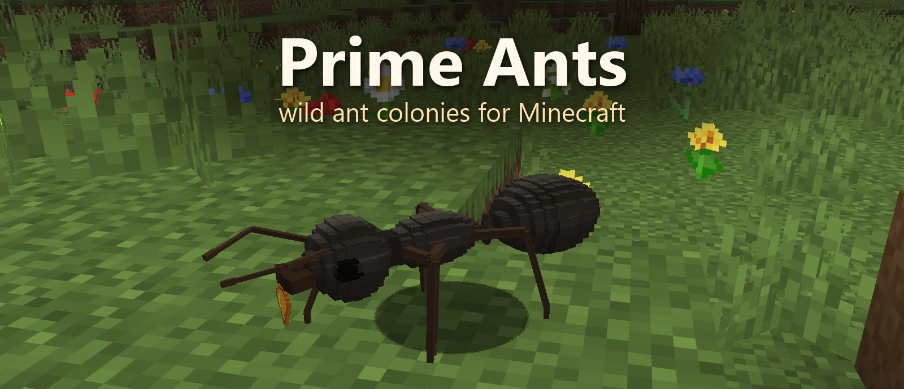

<p align="center">
  
</p>

<h3 align="center">Wild, realistic ant colonies for Minecraft. Every ant is a real creature.</h3>

<p align="center">
  🇷🇺 <a href="README.ru.md">Читать на русском</a>
</p>

<p align="center">
  
  
  
  
  <br>
  <a href="https://github.com/SupremeSoviet/prime-ants/releases/latest"></a>
  
  
  
  <a href="LICENSE"></a>
</p>

<p align="center">
  <a href="https://github.com/SupremeSoviet/prime-ants/releases/latest"><b>⬇️ Download</b></a> ·
  <a href="#-getting-started">Getting started</a> ·
  <a href="#%EF%B8%8F-gallery">Gallery</a> ·
  <a href="#%EF%B8%8F-roadmap">Roadmap</a>
</p>

---

## 🐜 What is this?

Prime Ants fills your world with wild colonies of the black garden ant, *Lasius niger*.

A young queen chooses a patch of meadow, digs a small chamber and raises her first workers on her own. Then the
colony takes over: workers open the entrance, carry soil out into a mound, bring home nectar and prey, and feed the
brood mouth to mouth.

There are no hidden counters. **A colony is exactly the ants you can see.** If one dies, it is gone, and the colony has
to raise a replacement.

## ✨ Features

| | |
|---|---|
| 👑 **Queens found colonies on their own** | in plains, meadows and flower forests, dug into natural terrain |
| 🥚 **A real brood cycle** | egg → larva → cocoon → pale young worker → adult |
| ⛏️ **Nests dug into the ground** | stairs and chambers two blocks high, with the soil carried out into a mound |
| 🌼 **Real food, carried home** | nectar from flowers, small prey in the grass, and tasty things you drop |
| 🤝 **Sharing** | nurses feed the queen and the larvae, and workers pass sugar mouth to mouth |
| 📈 **Growth that follows food** | a colony grows only as fast as food comes in; ants age, starve and die |
| 🛡️ **They defend their home** | hurt an ant or break the nest, and nearby workers will bite |
| 🔦 **You can visit** | walk down the stairs, light a chamber with a torch and watch the nursery |

> 🕰️ One in-game day is roughly one month in the life of a colony.

## 🖼️ Gallery

| | |
|:---:|:---:|
| <br><sub>A young nest: the entrance and the queen's soil mound</sub> | <br><sub>Inside by torchlight: the queen, workers, a pale young ant, a cocoon and a tiny white egg</sub> |
| <br><sub>A worker up close</sub> | <br><sub>The queen out in the daylight</sub> |

<sub>All pictures are real in-game captures; the camera was moved for framing. The banner and the queen show an earlier
model revision.</sub>

## 🚀 Getting started

**You need:** Minecraft Java Edition 26.3 · Java 25 · Fabric Loader 0.19.5 · Fabric API 0.161.0+26.3

1. Install a [Fabric](https://fabricmc.net/use/installer/) profile for Minecraft 26.3.
2. Put [`prime_ants-0.1.0.jar`](https://github.com/SupremeSoviet/prime-ants/releases/latest) and the matching
   [Fabric API](https://modrinth.com/mod/fabric-api) into your `mods` folder.
3. Create a **new world** and go looking for ants. 🔍

## 🔎 Finding and enjoying a colony

- **Where to look.** Plains, meadows and flower forests. Look for a small mound of soil next to a stair entrance, or a
  queen busy digging.
- **Be patient.** Each brood stage takes about 10 minutes, and the first workers appear about half an hour after the
  first eggs. Colonies live only while their chunks are loaded, so stay nearby.
- **Feeding.** Drop apples or sweet berries (sugar) and raw chicken or rotten flesh (protein) near a trail, then step
  back at least four blocks. Foragers pick the food up and carry it home.
- **Visiting.** Once the workers open the entrance, walk down the two-block-high stairs. Put a torch on a wall to see
  inside, and leave the walls, the nursery and the food store alone.
- **Manners.** Watching and feeding are welcome. Hitting ants or breaking their nest makes the workers bite (half a
  heart per bite).

## ⚠️ Good to know

This is an **early release (0.1.0)**:

- one species so far, and only young colonies;
- no nuptial flights, mature colonies at world generation or offline catch-up yet;
- a colony can stall in awkward terrain or when food runs short;
- long play sessions and multiplayer have barely been tested, so back up your worlds.

The full, honest list is in the [detailed release notes](docs/release-0.1.0-details.md) and the [technical report](docs/slice-1-report.md).

## 🗺️ Roadmap

- 🪽 nuptial flights, with young queens founding new colonies nearby
- 🏰 mature colonies with large nests at world generation
- 🌿 aphid herding and honeydew
- ⚔️ border fights and wars between colonies
- 📓 a field journal for your observations
- 🐜 more species: the red wood ant, a harvester ant and a leaf-cutter ant

## 🛠️ Building from source

```bash
./gradlew build
```

You need JDK 25. The jar ends up in `build/libs/`, and the build also runs the unit, model and in-game server tests.

## 📚 More

- [Player guide](docs/player-guide.md)
- [Technical report for 0.1.0](docs/slice-1-report.md)
- [Design decisions](docs/00-decisions.md) (in Russian)

## 📄 License

[MIT](LICENSE)
