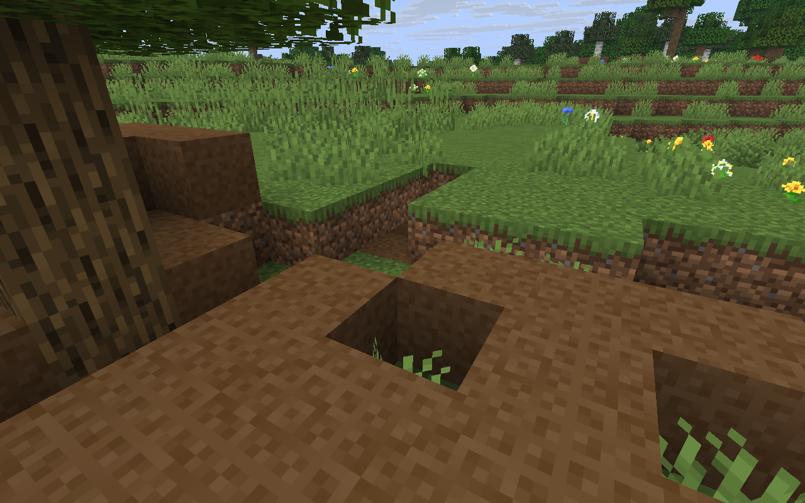
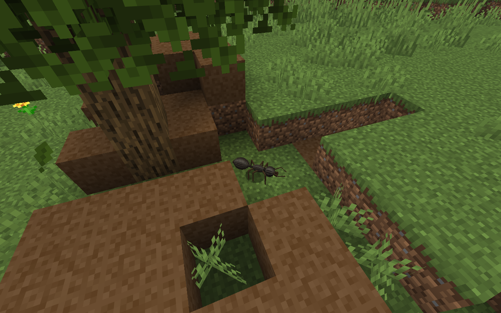
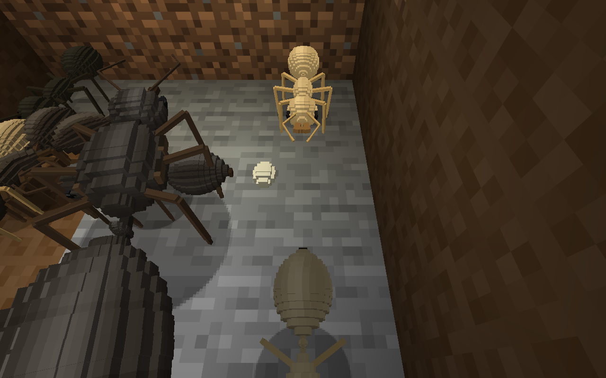
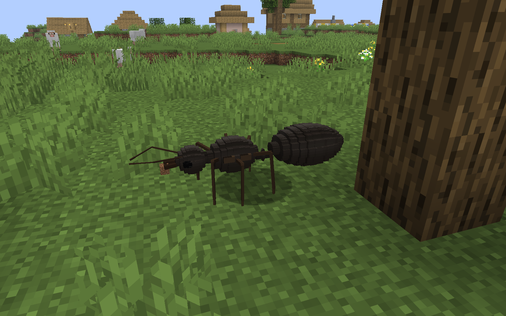

# Prime Ants 0.1.0: detailed release notes

> The full bilingual README that shipped with the 0.1.0 release candidate. The short version is the [main README](../README.md).

An early release about wild **Lasius niger** colonies that excavate, carry food and raise real workers. / Ранний выпуск о диких колониях **Lasius niger**, которые роют гнёзда, носят пищу и выращивают настоящих рабочих.

[English](#english) · [Русский](#русский) · [Gallery / Галерея](screenshots/t28-release.md) · [Technical report / Технический отчёт](slice-1-report.md)

## English

### Requirements and installation

Use **Minecraft Java Edition 26.3**, **64-bit Java 25**, **Fabric Loader 0.19.5** and **Fabric API 0.161.0+26.3**. The supported runtime is Java 25.0.3+9. Other Minecraft versions and modpacks have not been verified.

1. Install a Fabric profile for Minecraft 26.3 and select Java 25 in its launcher settings.
2. Copy the supplied runtime **`prime_ants-0.1.0.jar`** and the matching Fabric API JAR into that profile's `mods` folder. The verified release is [here](https://github.com/SupremeSoviet/prime-ants/releases/tag/v0.1.0).
3. Launch the Fabric profile and start a world. A new world is the clearest way to encounter natural founding sites. Back up an existing save before adding the mod; natural placement is tied to newly generated terrain.
4. For multiplayer, install matching versions of the mod and Fabric API on the server and each client. Broad multiplayer and modpack compatibility remain unverified.

T30 completed fresh acceptance: **15 unit / 201 server / 26 model**, with no failures, errors or skips. This exact JAR passed one ordinary clean-client fresh Survival world at default timing, natural queen placement and advancing loaded activity, then normal saving and exit with a settled, matching CRC-valid archive. **SHA-256:** `6cab3264ecf1e3c34ce7a3edcfc5ef2937eba5b845e8bce890f91fd68692f367`. Generation lag was observed at the ordinary 20 TPS target; this is not client performance acceptance. This short startup check does not establish long-session stability or continuing colony sustainability. Final evidence.

### What is implemented

Naturally placed founding queens look for suitable, dry native soil. A queen physically excavates stairs and a chamber, carries soil outside to form a mound, and seals the throat. Her finite bodily reserve pays for the first clutch. Eggs become larvae, cocoons and pale young workers, which mature into darker adults. The first workers physically open the entrance.

Workers forage, carry one food unit in their mandibles, store food in a visible cache, nurse brood and the queen, share ingested sweetness, and perform bounded nest expansion. Flowers provide nectar; native short grass and ferns can provide small prey. Dropped food and suitable animal loot are physical sources. Further laying depends on actual recent intake and food still available. Workers need meals, age and can die; killed ants are lost. Queen death ends further laying, although viable cocoons can still emerge. The current limit is 30 adults per colony, including the queen.

### Finding a colony and waiting

Look in **plains, meadows and flower forests** for a queen working the soil or a small mound with a stair entrance. Placement is enabled by default, but terrain must satisfy conservative soil, support and enclosure checks. Discovery near spawn and sustained growth at every suitable-looking site are not guaranteed.

At default speed and 20 server ticks per second, each brood stage takes about ten minutes. The first clutch needs roughly thirty minutes after laying, plus excavation and travel time. Missing care, food, safe habitat or emergence space can extend this substantially. Stay nearby: work and biological development progress in loaded, ticking chunks. Leaving the area, closing the world or pausing singleplayer stops progression; offline catch-up is not implemented.

### Watching, entering, feeding and lighting

Watch from a little distance and follow worker traffic. Once workers open the throat, use the existing two-block-high stairs to enter and return. Give ants room to pass. Preserve the chamber's walls, roof, floor, nursery, cache and remaining plugs; damaging the enclosure can halt development.

Drop **apples or sweet berries** near a trail for sweetness, and **raw chicken or rotten flesh** for protein. Immediately move at least four blocks away to avoid picking the food up again. Foragers must actually collect and deliver it, and nurses must feed recipients. Sweetness alone cannot support larvae. Feeding helps a wild colony but gives no direct control; past deliveries do not refill spent stores. Sustained growth at every site is not guaranteed.

In an opened chamber, place a supported torch on an existing wall and keep nursery/cache cells and work targets clear. Dry, collision-free lighting can coexist with the nest. An occupied future nursery cell is preserved: preparation waits until you explicitly remove the obstruction. Ants do not automatically erase the torch or relocate the nursery.

### Defense and limitations

Watching and feeding are benign. Hurting an ant in survival or successfully breaking an owned nest component raises a local alarm. Nearby mature workers approach the provoking player and bite at physical reach and visibility. A bite removes half a heart, with about one second between bites at 20 TPS. The alarm lasts about thirty loaded seconds; responders start within twelve blocks of the harm and pursuit stops beyond sixteen. Back away and stop causing harm. Ordinary Minecraft mobs can also threaten observers.

Only one species and early colony life are implemented. **Generation of already established colonies, nuptial flights and active harvesting of fruit plants are deferred.** There is no interface for assigning ant jobs. Conservative terrain checks, crowding, difficult routes and inadequate food can stall colonies; flooding or breaking the enclosure is not automatically repaired. Long sessions, abrupt-crash recovery and broader compatibility have not been established. An earlier native Java/C2 client crash remains a reliability concern; a successful startup is not a universal fix.

### Illustrations

Three original game images below show naturally founded colonies with current production code and assets; the fourth queen image uses a previous model revision. The colony was player-fed; camera relocation was used for framing. The source nursery retains accelerated brood timing. The pictures illustrate behavior, rather than default-speed discovery or unattended growth.

*Entrance and soil deposited by the queen; daylight, hidden HUD.*

*One genuine worker foraging at the entrance; daylight, spectator camera, hidden HUD.*

*The small white object near the center is a living egg. One normally placed wall torch lights this survival chamber view; ordinary brightness, no night vision, with possible daylight through the opened nest. The colony received four apples and two raw chicken from player inventory. Surrounding ants are partly cropped; the egg is unobscured.*

**T25 — previous model revision.** Historical daylight view of a naturally placed founding queen carrying excavated soil. This unchanged image supplies the fourth illustration; it does not establish current queen visual acceptance. The clipped current attempt remains rejected. [Gallery and capture qualifications](screenshots/t28-release.md) · [Player guide](player-guide.md) · [Technical report](slice-1-report.md).

## Русский

### Требования и установка

Нужны **Minecraft Java Edition 26.3**, **64-разрядная Java 25**, **Fabric Loader 0.19.5** и **Fabric API 0.161.0+26.3**. Поддерживаемая среда — Java 25.0.3+9. Другие версии Minecraft и сборки модов не проверены.

1. Установите профиль Fabric для Minecraft 26.3 и выберите Java 25 в настройках его запуска.
2. Поместите выданный основной файл **`prime_ants-0.1.0.jar`** и соответствующий JAR Fabric API в папку `mods` этого профиля. Проверенный выпуск находится [здесь](https://github.com/SupremeSoviet/prime-ants/releases/tag/v0.1.0).
3. Запустите профиль Fabric и откройте мир. В новом мире проще встретить естественные места основания колоний. Перед добавлением мода в существующий мир сделайте резервную копию: естественное появление связано с генерацией новых участков.
4. Для сетевой игры установите одинаковые версии мода и Fabric API на сервер и каждому игроку. Широкая совместимость сетевой игры и сборок модов ещё не проверена.

T30 завершил свежую приёмку: **15 модульных тестов, 201 серверный случай и 26 модельных случаев**, без ошибок, сбоев и пропусков. Именно этот JAR прошёл один запуск обычного чистого клиента с новым миром в выживании и стандартными таймингами: естественное размещение маток и развитие их загруженного состояния, затем нормальное сохранение и выход со стабильными файлами и совпадающим архивом с корректным CRC. **SHA-256:** `6cab3264ecf1e3c34ce7a3edcfc5ef2937eba5b845e8bce890f91fd68692f367`. При обычной цели 20 TPS наблюдались задержки генерации; это не приёмка производительности клиента. Короткая проверка запуска не подтверждает устойчивость долгих сеансов и дальнейшую жизнеспособность колоний. Итоговые доказательства.

### Что уже работает

Естественно появившиеся молодые матки ищут подходящий сухой природный грунт. Матка сама выкапывает лестницу и камеру, выносит грунт наружу, создавая холмик, и закрывает горловину. Ограниченные запасы её тела оплачивают первый выводок. Яйца становятся личинками, коконами и светлыми молодыми рабочими; повзрослев, рабочие темнеют. Первые рабочие сами открывают вход.

Рабочие ищут пищу, несут по одному предмету в жвалах, складывают его в видимый склад, кормят выводок и матку, делятся усвоенным сладким питанием и понемногу расширяют гнездо. Цветы дают нектар, природная невысокая трава и папоротники могут давать мелкую добычу. Брошенная еда и подходящие предметы, выпавшие из животных, тоже служат физическими источниками. Новая кладка зависит от настоящего недавнего питания и оставшихся запасов. Рабочим нужны кормления; они стареют и могут погибнуть. Убитые муравьи потеряны. После смерти матки новых яиц не будет, хотя жизнеспособные коконы ещё могут дать рабочих. Текущий предел — 30 взрослых на колонию, включая матку.

### Где искать и сколько ждать

Ищите на **равнинах, лугах и в цветочных лесах** матку, работающую с грунтом, или небольшой холмик с лестничным входом. Естественное появление включено по умолчанию, но участок должен пройти строгие проверки грунта, опоры и оболочки гнезда. Обнаружение рядом с точкой появления и устойчивый рост на каждом внешне подходящем участке не гарантированы.

На обычной скорости, при двадцати серверных тиках в секунду, каждая стадия выводка занимает около десяти минут. Первому выводку нужно примерно тридцать минут после кладки, плюс время на раскопку и перемещения. Недостаток ухода, пищи, безопасной среды или места для выхода рабочих может значительно увеличить ожидание. Оставайтесь рядом: работа и развитие идут в загруженных чанках, которые получают тики. Уход из района, закрытие мира и пауза одиночной игры останавливают развитие. Догоняющего расчёта за время отсутствия нет.

### Наблюдение, вход, подкормка и свет

Наблюдайте с небольшого расстояния и следите за движением рабочих. Когда они откроют горловину, спускайтесь и возвращайтесь по существующей лестнице высотой в два блока. Пропускайте встречных муравьёв. Сохраняйте стены, потолок, пол, ясли, склад и оставшиеся пробки: повреждение оболочки может остановить развитие.

Бросайте **яблоки или сладкие ягоды** возле тропы для сладкого питания, **сырую курятину или гнилую плоть** — для белкового. Сразу отойдите хотя бы на четыре блока, чтобы не подобрать еду обратно. Фуражиры должны действительно собрать и доставить пищу, а няньки — накормить получателей. Одного сладкого личинкам недостаточно. Подкормка помогает дикой колонии, но не даёт прямого управления; прошлые доставки не восстанавливают потраченные запасы. Постоянный рост на каждом участке не гарантирован.

В открытой камере ставьте факел с опорой на существующую стену, оставляя свободными клетки яслей, склада и рабочих задач. Сухое освещение без препятствия для движения может сосуществовать с гнездом. Занятая клетка будущих яслей сохраняется: подготовка ждёт, пока вы сами уберёте препятствие. Муравьи не удаляют такой факел автоматически и не переносят ясли.

### Защита и ограничения

Наблюдение и подкормка безопасны для отношений с колонией. Урон муравью от игрока в выживании или успешное разрушение принадлежащей колонии части гнезда вызывает местную тревогу. Ближайшие зрелые рабочие подходят к виновнику и кусают в пределах физической досягаемости и видимости. Укус снимает половину сердца; при двадцати тиках в секунду между укусами проходит около секунды. Тревога длится примерно тридцать загруженных секунд. Откликаются рабочие в пределах двенадцати блоков от места вреда; за шестнадцатью блоками преследование прекращается. Отойдите и перестаньте причинять вред. Обычные мобы Minecraft тоже могут напасть на наблюдателя.

Реализованы один вид и ранняя жизнь колонии. **Генерация уже развитых колоний, брачные лёты и активный сбор плодов с растений отложены.** Интерфейса для назначения муравьям заданий нет. Строгие проверки рельефа, теснота, сложные маршруты и недостаток питания могут остановить колонию; затопление и повреждение оболочки не исправляются автоматически. Долгие сеансы, восстановление после аварийного завершения и широкая совместимость ещё не подтверждены. Ранее происходил нативный клиентский сбой Java/C2; удачный запуск не означает универсального исправления.

### Иллюстрации

Три оригинальных игровых снимка показывают естественно основанные колонии с текущими основным кодом и ресурсами; четвёртый снимок матки использует предыдущую редакцию модели. Колонию подкармливали; для кадрирования перемещалась камера наблюдателя. Исходные ясли сохраняют ускоренное развитие выводка. Снимки показывают поведение, а не поиск на обычной скорости или рост без помощи игрока.

- [Вход и выброшенный грунт](screenshots/t28-release-entrance.png): открытый вход и холмик, созданный маткой; дневной свет, скрытый интерфейс.
- [Настоящий фуражир](screenshots/t28-release-forager.png): один рабочий ищет пищу у входа; дневной свет, камера наблюдателя, скрытый интерфейс.
- [Живое яйцо в освещённых яслях](screenshots/t28-release-interior.png): небольшой белый предмет около центра — живое яйцо. Один факел нормально поставлен на стену; вид снят из камеры в выживании, с обычной яркостью и без ночного зрения. Через открытое гнездо может попадать дневной свет. Из инвентаря игрока брошены четыре яблока и две сырые курятины. Окружающие муравьи частично обрезаны, яйцо ничем не закрыто.

- [Естественная матка при дневном свете — предыдущая редакция модели](screenshots/t25-appearance-a5-queen-queen-daylight.png): **T25 — previous model revision. / T25 — предыдущая редакция модели.** Исторический вид естественно появившейся матки, несущей выкопанный грунт. Неизменённый снимок даёт четвёртую иллюстрацию; он не подтверждает визуальную приёмку нынешней матки. Обрезанный текущий кадр остаётся отклонённым. [Галерея и условия съёмки](screenshots/t28-release.md) · [Руководство игрока](player-guide.md) · [Технический отчёт](slice-1-report.md).
