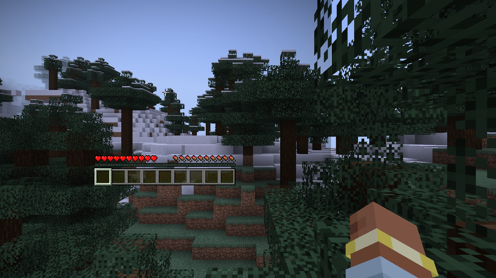
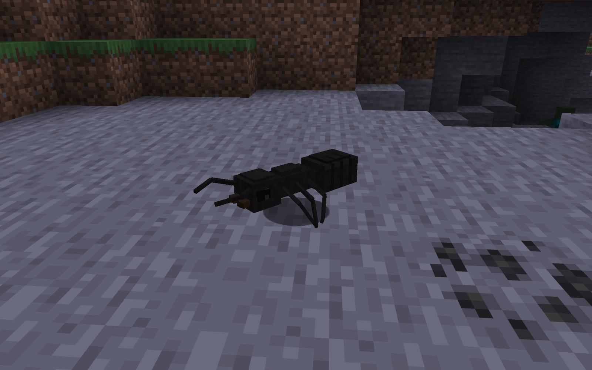
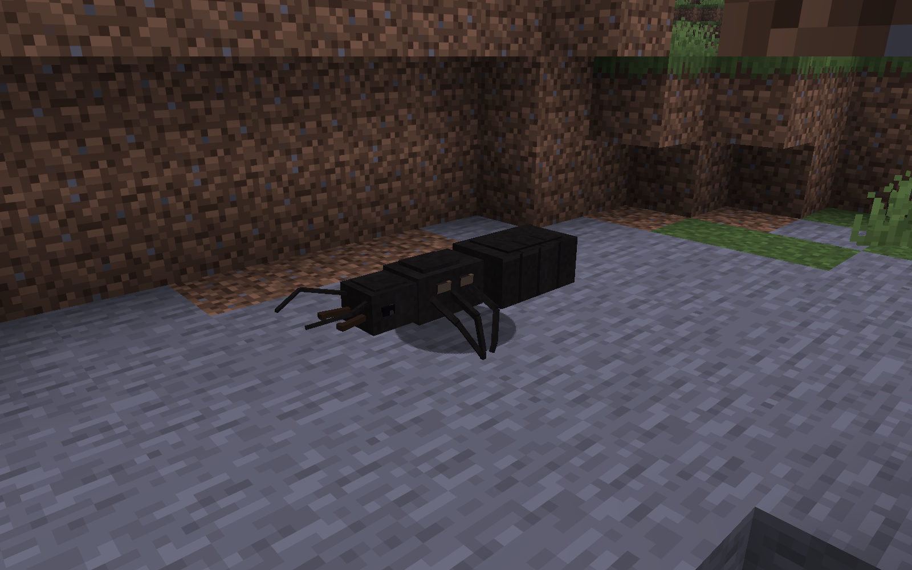

# Infrastructure captures

**T01 infrastructure capture; colony not implemented**

Automatically captured by Fabric client GameTest in a freshly generated normal survival world, seed `2026100401`, at the natural spawn/camera. No terrain editing, decorations, forced poses, or demonstration colony. The image was opened and observed to contain snowy terrain, spruce trees, sky, the survival HUD, and the player's hand. This is a rendered-gameplay observation, not a visual acceptance verdict. It satisfies none of the four eventual colony views.

- Command: `.\gradlew.bat runClientGameTest --console=plain`; exit `0`; client attempt `1`.
- Run start: `2026-10-04T14:55:02.0947520+05:00`.
- Capture time: `2026-10-04T09:56:11.695577400Z`.
- Wait for downloaded/rendered chunks: `42` ticks, then `5` additional ticks before capture.
- Path: `docs/screenshots/t01-infrastructure.png`.
- Dimensions: `1280 × 720`; size: `1,118,552` bytes.
- SHA-256: `0a8a35b2fece3dd9dcbf5142dba3c3ea4e037ff2cd75097ca35d3f49b9508609`.
- Provenance and complete logs: `C:\Users\user\Documents\turnloop\directions\prime-ants-slice1\turns\T01\capture-provenance.json` and `09-client-capture-attempt-1.{json,log}`.

## T02 debug entity specimens; colony not implemented

The final evidence is client attempt 4 in a fresh normal generated world, seed `2026100402`. These are production debug adults, not a brood-produced population or a completed colony close-up. Natural stone ground, terrain edges, trees and ore were left intact. Both adults retain AI and physics. The observer switches to spectator, follows each adult, hides HUD and uses FOV 45. No ant teleport, terrain edit, decoration, time/weather change or forced animation pose occurs.

Each PNG is 1600×1000. The three walking frames per form are separated by real game ticks and make changing leg positions inspectable; independent visual acceptance is pending. Full creation/movement records: [attempt 4 provenance](t02-capture-provenance.json). Earlier records are preserved in [attempt 2 provenance](t02-a2-capture-provenance.json) and [attempt 3 provenance](t02-a3-capture-provenance.json).

- `t02-a3-worker-walking-1.png` — **T02 debug entity specimens; colony not implemented**; worker, walking frame 1, attempt 3: isolated worker observation; run later failed waiting for the queen.
- `t02-a3-worker-walking-2.png` — **T02 debug entity specimens; colony not implemented**; worker, walking frame 2, attempt 3: isolated worker observation; run later failed waiting for the queen.
- `t02-a3-worker-walking-3.png` — **T02 debug entity specimens; colony not implemented**; worker, walking frame 3, attempt 3: isolated worker observation; run later failed waiting for the queen.
- `t02-a4-queen-walking-1.png` — **T02 debug entity specimens; colony not implemented**; queen, walking frame 1, attempt 4: final autonomous walking close-up.
- `t02-a4-queen-walking-2.png` — **T02 debug entity specimens; colony not implemented**; queen, walking frame 2, attempt 4: final autonomous walking close-up.
- `t02-a4-queen-walking-3.png` — **T02 debug entity specimens; colony not implemented**; queen, walking frame 3, attempt 4: final autonomous walking close-up.
- `t02-a4-worker-walking-1.png` — **T02 debug entity specimens; colony not implemented**; worker, walking frame 1, attempt 4: final autonomous walking close-up.
- `t02-a4-worker-walking-2.png` — **T02 debug entity specimens; colony not implemented**; worker, walking frame 2, attempt 4: final autonomous walking close-up.
- `t02-a4-worker-walking-3.png` — **T02 debug entity specimens; colony not implemented**; worker, walking frame 3, attempt 4: final autonomous walking close-up.
- `t02-queen-walking-1.png` — **T02 debug entity specimens; colony not implemented**; queen, walking frame 1, attempt 2: initial mixed adult observation; queen partly occludes worker.
- `t02-queen-walking-2.png` — **T02 debug entity specimens; colony not implemented**; queen, walking frame 2, attempt 2: initial mixed adult observation; queen partly occludes worker.
- `t02-queen-walking-3.png` — **T02 debug entity specimens; colony not implemented**; queen, walking frame 3, attempt 2: initial mixed adult observation; queen partly occludes worker.
- `t02-worker-walking-1.png` — **T02 debug entity specimens; colony not implemented**; worker, walking frame 1, attempt 2: initial mixed adult observation; queen partly occludes worker.
- `t02-worker-walking-2.png` — **T02 debug entity specimens; colony not implemented**; worker, walking frame 2, attempt 2: initial mixed adult observation; queen partly occludes worker.
- `t02-worker-walking-3.png` — **T02 debug entity specimens; colony not implemented**; worker, walking frame 3, attempt 2: initial mixed adult observation; queen partly occludes worker.

- **Worker** UUID `b6dbc54f-b790-40fb-856a-d998af428dd1`; creation route: `ordinary operator /summon prime_ants:lasius_niger_worker -14.50 69.00 6.50`. Created at server game tick 61, elapsed age 1. Walking frames at server ticks 96, 102, 108 / ages 36, 42, 48. From first to third frame, horizontal displacement 0.8424 blocks in 12 ticks. Positions [-14.399417238711827, 69.0, 6.600574659240077] → [-13.803730328901468, 69.0, 7.196259994981051]. AI, ground contact and normal physics observed active in all frames.
- **Queen** UUID `f428e324-bddc-48cf-95c1-cc2bb00a9ec5`; creation route: `production queen egg: client useItemOn -> packet -> ItemStack.useOn -> SpawnEggItem`. Created at server game tick 59, elapsed age 1. Walking frames at server ticks 116, 122, 128 / ages 58, 64, 70. From first to third frame, horizontal displacement 0.3739 blocks in 12 ticks. Positions [-9.560473028457066, 73.0, -12.490382755233302] → [-9.934329113352671, 73.0, -12.492358325157618]. AI, ground contact and normal physics observed active in all frames.

| Final image | SHA-256 |
| --- | --- |
| `t02-a4-queen-walking-1.png` | `bccda1bf50ba5e20a5769cb5ccfea42d96c45eacaa183f2d1735fa430923f6b8` |
| `t02-a4-queen-walking-2.png` | `993a592f7038afd5e1e149b64c93e50263d6cc0e6c11c8d0a3272ce95ea3f910` |
| `t02-a4-queen-walking-3.png` | `1a95272854dde5d6486b8e94498264ca1e55c6d1174d3c0c4b0b2ab94950a8f3` |
| `t02-a4-worker-walking-1.png` | `c3e9ce3629dcdd0183a3edf4ed0b96cd673140275c76691836ed4ce3951d8b13` |
| `t02-a4-worker-walking-2.png` | `d8445053fdfc0821128d14654ea66a5abf3dfe607dac060e8175adcad6d2d8fb` |
| `t02-a4-worker-walking-3.png` | `fe91c302d9df5989298e52648a63b0ae27f9b31f1c80c36a5dfc83cb62bafd15` |

Capture history: attempt 2 exit 0 (29.886 s, composition concern); attempt 3 exit 1 (43.397 s, queen idle-goal bug); server reproducer failed before correction and passed after correction; attempt 4 exit 0 (26.189 s). T01 remains byte-identical. All earlier captures are retained; no image is a colony acceptance claim.

## T03 incomplete attempts

The mirrored-yaw defect was reproduced against the original factory before correction. The current production model uses connected hip/femur/tibia/tarsus inverse kinematics: each stance sweeps monotonically rearward, the complementary tripod returns forward with clearance, and roles exchange every half-cycle. Constant distance-based stride follows the adult vanilla smoothed walk-distance input; movement speed changes cadence and lift rather than scaling longitudinal stride twice. Idle resets feet while antennae continue moving.

Head, mesosoma and gaster use tapered stepped contours. One petiole node and a slender continuous stalk connect the waist; neck, hips, antenna bases and queen scars attach to baked body geometry. Body lengths remain 1.025142 worker / 2.271376 queen blocks, with 32 texels per world block. Body heights excluding appendages are 0.2109375 / 0.40625. Maximum node widths changed from 0.0625 / 0.125 to 0.05625 / 0.109375; stalk widths are 0.025 / 0.046875. Head/mesosoma/gaster anterior widths are 48% of maximum instead of 100% in T02. These measurements are geometric evidence, not visual approval.

Current model discovery executes 24 named cases (12 per form). Tests use ModelPart.visit and actual baked distal tarsus geometry, 64 intervals/cycle at speed inputs 0.03, 0.28, 0.35 and 1.0. A separate offline current-factory probe passed all 70 render inputs preserved from T03 a1/a2. The full CSV traces, before/after failures, profile slices, XML, logs and archive inspections are in the external T03 evidence directory.

The client guard now generates a fresh UUID before launch, passes it to both entrypoints, and uses unique attempt prefixes. It checks named model discovery, matching IDs, capture completion, both forms and side/oblique sequences, support alternation, cycle coverage, and PNG path/time/dimensions/SHA-256. Ten negative fixtures are rejected without Minecraft. Offline validation also rejects the actual failed a3 manifest (18-current-failure-rejected, exit 1) despite old successful provenance remaining present. Initial discovery accidentally included the offline profilesOnly helper; the failure and offline recovery are preserved. Fixtures now use an actually executed headless model XML instead of synthesizing names from the same discovery regex.

No final completion is claimed. Last successful full build: t03-build-final-distance-gait, exit 0, 16.486 s (15 unit, 16 server, 24 model cases). Later builds failed the unchanged queen_wanders_after_long_idle case twice at tick 242; the isolated unchanged case passed at age 136 between them. RandomStrollGoal gates both opportunity and destination; stochastic failure is a supported hypothesis, not an established root-cause fix. Assertions, 240-tick limit, entity mechanics, 0.15 waypoint tolerance, 600-tick queen navigation allowance and production idle-goal correction remain unchanged.

Client a1 exited 1 at the Gradle discovery guard after producing 48 provisional frames; its current-run files passed offline validation after the regex fix. Client a2 exited 1 after 22 current-model queen frames (12 side, 10 oblique); saved terrain confirms its later waiting positions lacked the required 3x3 observation clearance despite active walking. Client a3 exited 1 before specimens/PNGs: the natural plateau found in an offline region scan did not pass live ground selection. Screenshot work is stopped under the repeated-attempt criterion. The executor also launched a3 before inspecting the preceding failed build result, violating the requested success-before-client sequence.

T03 added 3 client launches: Minecraft processes 1 success / 2 failures; all 3 overall Gradle client tasks failed. Lifetime: 7 launches, Minecraft processes 4 successes / 3 failures; overall dedicated client tasks 3 successes / 4 failures. No PNG or JSON from T01/T02 changed (19 original files hash-verified). There are 70 T03 PNGs with individual captions; final worker distance-based gait has no gameplay screenshots. Anatomy/readability acceptance stays with the independent reviewer.

Known OSHI/Perflib, empty client resources, anisotropic-filter default, development-token Realms, passenger-update and Gradle/API deprecation diagnostics remain preserved. Read logs by BOM and JSON as UTF-8 (UTF-8 BOM accepted). No toolchain, global setting, authentication, terrain, AI, physics, permission, or owner-world workaround was made. Full world restart, offline catch-up, lifespan, brood replacement, colony behavior and 20+ ant performance remain unresolved.

Owner decision needed before another autonomous verification turn: may the stochastic server idle fixture be stabilized (for example a recorded fixed random seed) while keeping all assertions, its 240-tick bound and production mechanics? Ground-probe synchronization/live terrain validation also needs diagnosis within capture scope; another unchanged client run is not recovery.

- [t03-a1-worker-side-1.png](t03-a1-worker-side-1.png) — **T03 debug entity specimens; colony not implemented**; worker, side, sequence 1/12. Overall Gradle client task failed discovery; Minecraft capture completed. Provisional model before the final distance-based stride, attachment and texture corrections. Queen frames can approach a natural wall. Not final-model acceptance evidence.
- [t03-a1-worker-side-2.png](t03-a1-worker-side-2.png) — **T03 debug entity specimens; colony not implemented**; worker, side, sequence 2/12. Overall Gradle client task failed discovery; Minecraft capture completed. Provisional model before the final distance-based stride, attachment and texture corrections. Queen frames can approach a natural wall. Not final-model acceptance evidence.
- [t03-a1-worker-side-3.png](t03-a1-worker-side-3.png) — **T03 debug entity specimens; colony not implemented**; worker, side, sequence 3/12. Overall Gradle client task failed discovery; Minecraft capture completed. Provisional model before the final distance-based stride, attachment and texture corrections. Queen frames can approach a natural wall. Not final-model acceptance evidence.
- [t03-a1-worker-side-4.png](t03-a1-worker-side-4.png) — **T03 debug entity specimens; colony not implemented**; worker, side, sequence 4/12. Overall Gradle client task failed discovery; Minecraft capture completed. Provisional model before the final distance-based stride, attachment and texture corrections. Queen frames can approach a natural wall. Not final-model acceptance evidence.
- [t03-a1-worker-side-5.png](t03-a1-worker-side-5.png) — **T03 debug entity specimens; colony not implemented**; worker, side, sequence 5/12. Overall Gradle client task failed discovery; Minecraft capture completed. Provisional model before the final distance-based stride, attachment and texture corrections. Queen frames can approach a natural wall. Not final-model acceptance evidence.
- [t03-a1-worker-side-6.png](t03-a1-worker-side-6.png) — **T03 debug entity specimens; colony not implemented**; worker, side, sequence 6/12. Overall Gradle client task failed discovery; Minecraft capture completed. Provisional model before the final distance-based stride, attachment and texture corrections. Queen frames can approach a natural wall. Not final-model acceptance evidence.
- [t03-a1-worker-side-7.png](t03-a1-worker-side-7.png) — **T03 debug entity specimens; colony not implemented**; worker, side, sequence 7/12. Overall Gradle client task failed discovery; Minecraft capture completed. Provisional model before the final distance-based stride, attachment and texture corrections. Queen frames can approach a natural wall. Not final-model acceptance evidence.
- [t03-a1-worker-side-8.png](t03-a1-worker-side-8.png) — **T03 debug entity specimens; colony not implemented**; worker, side, sequence 8/12. Overall Gradle client task failed discovery; Minecraft capture completed. Provisional model before the final distance-based stride, attachment and texture corrections. Queen frames can approach a natural wall. Not final-model acceptance evidence.
- [t03-a1-worker-side-9.png](t03-a1-worker-side-9.png) — **T03 debug entity specimens; colony not implemented**; worker, side, sequence 9/12. Overall Gradle client task failed discovery; Minecraft capture completed. Provisional model before the final distance-based stride, attachment and texture corrections. Queen frames can approach a natural wall. Not final-model acceptance evidence.
- [t03-a1-worker-side-10.png](t03-a1-worker-side-10.png) — **T03 debug entity specimens; colony not implemented**; worker, side, sequence 10/12. Overall Gradle client task failed discovery; Minecraft capture completed. Provisional model before the final distance-based stride, attachment and texture corrections. Queen frames can approach a natural wall. Not final-model acceptance evidence.
- [t03-a1-worker-side-11.png](t03-a1-worker-side-11.png) — **T03 debug entity specimens; colony not implemented**; worker, side, sequence 11/12. Overall Gradle client task failed discovery; Minecraft capture completed. Provisional model before the final distance-based stride, attachment and texture corrections. Queen frames can approach a natural wall. Not final-model acceptance evidence.
- [t03-a1-worker-side-12.png](t03-a1-worker-side-12.png) — **T03 debug entity specimens; colony not implemented**; worker, side, sequence 12/12. Overall Gradle client task failed discovery; Minecraft capture completed. Provisional model before the final distance-based stride, attachment and texture corrections. Queen frames can approach a natural wall. Not final-model acceptance evidence.
- [t03-a1-worker-oblique-1.png](t03-a1-worker-oblique-1.png) — **T03 debug entity specimens; colony not implemented**; worker, oblique, sequence 1/12. Overall Gradle client task failed discovery; Minecraft capture completed. Provisional model before the final distance-based stride, attachment and texture corrections. Queen frames can approach a natural wall. Not final-model acceptance evidence.
- [t03-a1-worker-oblique-2.png](t03-a1-worker-oblique-2.png) — **T03 debug entity specimens; colony not implemented**; worker, oblique, sequence 2/12. Overall Gradle client task failed discovery; Minecraft capture completed. Provisional model before the final distance-based stride, attachment and texture corrections. Queen frames can approach a natural wall. Not final-model acceptance evidence.
- [t03-a1-worker-oblique-3.png](t03-a1-worker-oblique-3.png) — **T03 debug entity specimens; colony not implemented**; worker, oblique, sequence 3/12. Overall Gradle client task failed discovery; Minecraft capture completed. Provisional model before the final distance-based stride, attachment and texture corrections. Queen frames can approach a natural wall. Not final-model acceptance evidence.
- [t03-a1-worker-oblique-4.png](t03-a1-worker-oblique-4.png) — **T03 debug entity specimens; colony not implemented**; worker, oblique, sequence 4/12. Overall Gradle client task failed discovery; Minecraft capture completed. Provisional model before the final distance-based stride, attachment and texture corrections. Queen frames can approach a natural wall. Not final-model acceptance evidence.
- [t03-a1-worker-oblique-5.png](t03-a1-worker-oblique-5.png) — **T03 debug entity specimens; colony not implemented**; worker, oblique, sequence 5/12. Overall Gradle client task failed discovery; Minecraft capture completed. Provisional model before the final distance-based stride, attachment and texture corrections. Queen frames can approach a natural wall. Not final-model acceptance evidence.
- [t03-a1-worker-oblique-6.png](t03-a1-worker-oblique-6.png) — **T03 debug entity specimens; colony not implemented**; worker, oblique, sequence 6/12. Overall Gradle client task failed discovery; Minecraft capture completed. Provisional model before the final distance-based stride, attachment and texture corrections. Queen frames can approach a natural wall. Not final-model acceptance evidence.
- [t03-a1-worker-oblique-7.png](t03-a1-worker-oblique-7.png) — **T03 debug entity specimens; colony not implemented**; worker, oblique, sequence 7/12. Overall Gradle client task failed discovery; Minecraft capture completed. Provisional model before the final distance-based stride, attachment and texture corrections. Queen frames can approach a natural wall. Not final-model acceptance evidence.
- [t03-a1-worker-oblique-8.png](t03-a1-worker-oblique-8.png) — **T03 debug entity specimens; colony not implemented**; worker, oblique, sequence 8/12. Overall Gradle client task failed discovery; Minecraft capture completed. Provisional model before the final distance-based stride, attachment and texture corrections. Queen frames can approach a natural wall. Not final-model acceptance evidence.
- [t03-a1-worker-oblique-9.png](t03-a1-worker-oblique-9.png) — **T03 debug entity specimens; colony not implemented**; worker, oblique, sequence 9/12. Overall Gradle client task failed discovery; Minecraft capture completed. Provisional model before the final distance-based stride, attachment and texture corrections. Queen frames can approach a natural wall. Not final-model acceptance evidence.
- [t03-a1-worker-oblique-10.png](t03-a1-worker-oblique-10.png) — **T03 debug entity specimens; colony not implemented**; worker, oblique, sequence 10/12. Overall Gradle client task failed discovery; Minecraft capture completed. Provisional model before the final distance-based stride, attachment and texture corrections. Queen frames can approach a natural wall. Not final-model acceptance evidence.
- [t03-a1-worker-oblique-11.png](t03-a1-worker-oblique-11.png) — **T03 debug entity specimens; colony not implemented**; worker, oblique, sequence 11/12. Overall Gradle client task failed discovery; Minecraft capture completed. Provisional model before the final distance-based stride, attachment and texture corrections. Queen frames can approach a natural wall. Not final-model acceptance evidence.
- [t03-a1-worker-oblique-12.png](t03-a1-worker-oblique-12.png) — **T03 debug entity specimens; colony not implemented**; worker, oblique, sequence 12/12. Overall Gradle client task failed discovery; Minecraft capture completed. Provisional model before the final distance-based stride, attachment and texture corrections. Queen frames can approach a natural wall. Not final-model acceptance evidence.
- [t03-a1-queen-side-1.png](t03-a1-queen-side-1.png) — **T03 debug entity specimens; colony not implemented**; queen, side, sequence 1/12. Overall Gradle client task failed discovery; Minecraft capture completed. Provisional model before the final distance-based stride, attachment and texture corrections. Queen frames can approach a natural wall. Not final-model acceptance evidence.
- [t03-a1-queen-side-2.png](t03-a1-queen-side-2.png) — **T03 debug entity specimens; colony not implemented**; queen, side, sequence 2/12. Overall Gradle client task failed discovery; Minecraft capture completed. Provisional model before the final distance-based stride, attachment and texture corrections. Queen frames can approach a natural wall. Not final-model acceptance evidence.
- [t03-a1-queen-side-3.png](t03-a1-queen-side-3.png) — **T03 debug entity specimens; colony not implemented**; queen, side, sequence 3/12. Overall Gradle client task failed discovery; Minecraft capture completed. Provisional model before the final distance-based stride, attachment and texture corrections. Queen frames can approach a natural wall. Not final-model acceptance evidence.
- [t03-a1-queen-side-4.png](t03-a1-queen-side-4.png) — **T03 debug entity specimens; colony not implemented**; queen, side, sequence 4/12. Overall Gradle client task failed discovery; Minecraft capture completed. Provisional model before the final distance-based stride, attachment and texture corrections. Queen frames can approach a natural wall. Not final-model acceptance evidence.
- [t03-a1-queen-side-5.png](t03-a1-queen-side-5.png) — **T03 debug entity specimens; colony not implemented**; queen, side, sequence 5/12. Overall Gradle client task failed discovery; Minecraft capture completed. Provisional model before the final distance-based stride, attachment and texture corrections. Queen frames can approach a natural wall. Not final-model acceptance evidence.
- [t03-a1-queen-side-6.png](t03-a1-queen-side-6.png) — **T03 debug entity specimens; colony not implemented**; queen, side, sequence 6/12. Overall Gradle client task failed discovery; Minecraft capture completed. Provisional model before the final distance-based stride, attachment and texture corrections. Queen frames can approach a natural wall. Not final-model acceptance evidence.
- [t03-a1-queen-side-7.png](t03-a1-queen-side-7.png) — **T03 debug entity specimens; colony not implemented**; queen, side, sequence 7/12. Overall Gradle client task failed discovery; Minecraft capture completed. Provisional model before the final distance-based stride, attachment and texture corrections. Queen frames can approach a natural wall. Not final-model acceptance evidence.
- [t03-a1-queen-side-8.png](t03-a1-queen-side-8.png) — **T03 debug entity specimens; colony not implemented**; queen, side, sequence 8/12. Overall Gradle client task failed discovery; Minecraft capture completed. Provisional model before the final distance-based stride, attachment and texture corrections. Queen frames can approach a natural wall. Not final-model acceptance evidence.
- [t03-a1-queen-side-9.png](t03-a1-queen-side-9.png) — **T03 debug entity specimens; colony not implemented**; queen, side, sequence 9/12. Overall Gradle client task failed discovery; Minecraft capture completed. Provisional model before the final distance-based stride, attachment and texture corrections. Queen frames can approach a natural wall. Not final-model acceptance evidence.
- [t03-a1-queen-side-10.png](t03-a1-queen-side-10.png) — **T03 debug entity specimens; colony not implemented**; queen, side, sequence 10/12. Overall Gradle client task failed discovery; Minecraft capture completed. Provisional model before the final distance-based stride, attachment and texture corrections. Queen frames can approach a natural wall. Not final-model acceptance evidence.
- [t03-a1-queen-side-11.png](t03-a1-queen-side-11.png) — **T03 debug entity specimens; colony not implemented**; queen, side, sequence 11/12. Overall Gradle client task failed discovery; Minecraft capture completed. Provisional model before the final distance-based stride, attachment and texture corrections. Queen frames can approach a natural wall. Not final-model acceptance evidence.
- [t03-a1-queen-side-12.png](t03-a1-queen-side-12.png) — **T03 debug entity specimens; colony not implemented**; queen, side, sequence 12/12. Overall Gradle client task failed discovery; Minecraft capture completed. Provisional model before the final distance-based stride, attachment and texture corrections. Queen frames can approach a natural wall. Not final-model acceptance evidence.
- [t03-a1-queen-oblique-1.png](t03-a1-queen-oblique-1.png) — **T03 debug entity specimens; colony not implemented**; queen, oblique, sequence 1/12. Overall Gradle client task failed discovery; Minecraft capture completed. Provisional model before the final distance-based stride, attachment and texture corrections. Queen frames can approach a natural wall. Not final-model acceptance evidence.
- [t03-a1-queen-oblique-2.png](t03-a1-queen-oblique-2.png) — **T03 debug entity specimens; colony not implemented**; queen, oblique, sequence 2/12. Overall Gradle client task failed discovery; Minecraft capture completed. Provisional model before the final distance-based stride, attachment and texture corrections. Queen frames can approach a natural wall. Not final-model acceptance evidence.
- [t03-a1-queen-oblique-3.png](t03-a1-queen-oblique-3.png) — **T03 debug entity specimens; colony not implemented**; queen, oblique, sequence 3/12. Overall Gradle client task failed discovery; Minecraft capture completed. Provisional model before the final distance-based stride, attachment and texture corrections. Queen frames can approach a natural wall. Not final-model acceptance evidence.
- [t03-a1-queen-oblique-4.png](t03-a1-queen-oblique-4.png) — **T03 debug entity specimens; colony not implemented**; queen, oblique, sequence 4/12. Overall Gradle client task failed discovery; Minecraft capture completed. Provisional model before the final distance-based stride, attachment and texture corrections. Queen frames can approach a natural wall. Not final-model acceptance evidence.
- [t03-a1-queen-oblique-5.png](t03-a1-queen-oblique-5.png) — **T03 debug entity specimens; colony not implemented**; queen, oblique, sequence 5/12. Overall Gradle client task failed discovery; Minecraft capture completed. Provisional model before the final distance-based stride, attachment and texture corrections. Queen frames can approach a natural wall. Not final-model acceptance evidence.
- [t03-a1-queen-oblique-6.png](t03-a1-queen-oblique-6.png) — **T03 debug entity specimens; colony not implemented**; queen, oblique, sequence 6/12. Overall Gradle client task failed discovery; Minecraft capture completed. Provisional model before the final distance-based stride, attachment and texture corrections. Queen frames can approach a natural wall. Not final-model acceptance evidence.
- [t03-a1-queen-oblique-7.png](t03-a1-queen-oblique-7.png) — **T03 debug entity specimens; colony not implemented**; queen, oblique, sequence 7/12. Overall Gradle client task failed discovery; Minecraft capture completed. Provisional model before the final distance-based stride, attachment and texture corrections. Queen frames can approach a natural wall. Not final-model acceptance evidence.
- [t03-a1-queen-oblique-8.png](t03-a1-queen-oblique-8.png) — **T03 debug entity specimens; colony not implemented**; queen, oblique, sequence 8/12. Overall Gradle client task failed discovery; Minecraft capture completed. Provisional model before the final distance-based stride, attachment and texture corrections. Queen frames can approach a natural wall. Not final-model acceptance evidence.
- [t03-a1-queen-oblique-9.png](t03-a1-queen-oblique-9.png) — **T03 debug entity specimens; colony not implemented**; queen, oblique, sequence 9/12. Overall Gradle client task failed discovery; Minecraft capture completed. Provisional model before the final distance-based stride, attachment and texture corrections. Queen frames can approach a natural wall. Not final-model acceptance evidence.
- [t03-a1-queen-oblique-10.png](t03-a1-queen-oblique-10.png) — **T03 debug entity specimens; colony not implemented**; queen, oblique, sequence 10/12. Overall Gradle client task failed discovery; Minecraft capture completed. Provisional model before the final distance-based stride, attachment and texture corrections. Queen frames can approach a natural wall. Not final-model acceptance evidence.
- [t03-a1-queen-oblique-11.png](t03-a1-queen-oblique-11.png) — **T03 debug entity specimens; colony not implemented**; queen, oblique, sequence 11/12. Overall Gradle client task failed discovery; Minecraft capture completed. Provisional model before the final distance-based stride, attachment and texture corrections. Queen frames can approach a natural wall. Not final-model acceptance evidence.
- [t03-a1-queen-oblique-12.png](t03-a1-queen-oblique-12.png) — **T03 debug entity specimens; colony not implemented**; queen, oblique, sequence 12/12. Overall Gradle client task failed discovery; Minecraft capture completed. Provisional model before the final distance-based stride, attachment and texture corrections. Queen frames can approach a natural wall. Not final-model acceptance evidence.
- [t03-a2-queen-side-1.png](t03-a2-queen-side-1.png) — **T03 debug entity specimens; colony not implemented**; queen, side, sequence 1/12. Partial attempt: 12 side and 10 oblique queen frames; later failed on terrain observation eligibility. No worker images. Current production model, but incomplete client evidence and no acceptance verdict.
- [t03-a2-queen-side-2.png](t03-a2-queen-side-2.png) — **T03 debug entity specimens; colony not implemented**; queen, side, sequence 2/12. Partial attempt: 12 side and 10 oblique queen frames; later failed on terrain observation eligibility. No worker images. Current production model, but incomplete client evidence and no acceptance verdict.
- [t03-a2-queen-side-3.png](t03-a2-queen-side-3.png) — **T03 debug entity specimens; colony not implemented**; queen, side, sequence 3/12. Partial attempt: 12 side and 10 oblique queen frames; later failed on terrain observation eligibility. No worker images. Current production model, but incomplete client evidence and no acceptance verdict.
- [t03-a2-queen-side-4.png](t03-a2-queen-side-4.png) — **T03 debug entity specimens; colony not implemented**; queen, side, sequence 4/12. Partial attempt: 12 side and 10 oblique queen frames; later failed on terrain observation eligibility. No worker images. Current production model, but incomplete client evidence and no acceptance verdict.
- [t03-a2-queen-side-5.png](t03-a2-queen-side-5.png) — **T03 debug entity specimens; colony not implemented**; queen, side, sequence 5/12. Partial attempt: 12 side and 10 oblique queen frames; later failed on terrain observation eligibility. No worker images. Current production model, but incomplete client evidence and no acceptance verdict.
- [t03-a2-queen-side-6.png](t03-a2-queen-side-6.png) — **T03 debug entity specimens; colony not implemented**; queen, side, sequence 6/12. Partial attempt: 12 side and 10 oblique queen frames; later failed on terrain observation eligibility. No worker images. Current production model, but incomplete client evidence and no acceptance verdict.
- [t03-a2-queen-side-7.png](t03-a2-queen-side-7.png) — **T03 debug entity specimens; colony not implemented**; queen, side, sequence 7/12. Partial attempt: 12 side and 10 oblique queen frames; later failed on terrain observation eligibility. No worker images. Current production model, but incomplete client evidence and no acceptance verdict.
- [t03-a2-queen-side-8.png](t03-a2-queen-side-8.png) — **T03 debug entity specimens; colony not implemented**; queen, side, sequence 8/12. Partial attempt: 12 side and 10 oblique queen frames; later failed on terrain observation eligibility. No worker images. Current production model, but incomplete client evidence and no acceptance verdict.
- [t03-a2-queen-side-9.png](t03-a2-queen-side-9.png) — **T03 debug entity specimens; colony not implemented**; queen, side, sequence 9/12. Partial attempt: 12 side and 10 oblique queen frames; later failed on terrain observation eligibility. No worker images. Current production model, but incomplete client evidence and no acceptance verdict.
- [t03-a2-queen-side-10.png](t03-a2-queen-side-10.png) — **T03 debug entity specimens; colony not implemented**; queen, side, sequence 10/12. Partial attempt: 12 side and 10 oblique queen frames; later failed on terrain observation eligibility. No worker images. Current production model, but incomplete client evidence and no acceptance verdict.
- [t03-a2-queen-side-11.png](t03-a2-queen-side-11.png) — **T03 debug entity specimens; colony not implemented**; queen, side, sequence 11/12. Partial attempt: 12 side and 10 oblique queen frames; later failed on terrain observation eligibility. No worker images. Current production model, but incomplete client evidence and no acceptance verdict.
- [t03-a2-queen-side-12.png](t03-a2-queen-side-12.png) — **T03 debug entity specimens; colony not implemented**; queen, side, sequence 12/12. Partial attempt: 12 side and 10 oblique queen frames; later failed on terrain observation eligibility. No worker images. Current production model, but incomplete client evidence and no acceptance verdict.
- [t03-a2-queen-oblique-1.png](t03-a2-queen-oblique-1.png) — **T03 debug entity specimens; colony not implemented**; queen, oblique, sequence 1/12. Partial attempt: 12 side and 10 oblique queen frames; later failed on terrain observation eligibility. No worker images. Current production model, but incomplete client evidence and no acceptance verdict.
- [t03-a2-queen-oblique-2.png](t03-a2-queen-oblique-2.png) — **T03 debug entity specimens; colony not implemented**; queen, oblique, sequence 2/12. Partial attempt: 12 side and 10 oblique queen frames; later failed on terrain observation eligibility. No worker images. Current production model, but incomplete client evidence and no acceptance verdict.
- [t03-a2-queen-oblique-3.png](t03-a2-queen-oblique-3.png) — **T03 debug entity specimens; colony not implemented**; queen, oblique, sequence 3/12. Partial attempt: 12 side and 10 oblique queen frames; later failed on terrain observation eligibility. No worker images. Current production model, but incomplete client evidence and no acceptance verdict.
- [t03-a2-queen-oblique-4.png](t03-a2-queen-oblique-4.png) — **T03 debug entity specimens; colony not implemented**; queen, oblique, sequence 4/12. Partial attempt: 12 side and 10 oblique queen frames; later failed on terrain observation eligibility. No worker images. Current production model, but incomplete client evidence and no acceptance verdict.
- [t03-a2-queen-oblique-5.png](t03-a2-queen-oblique-5.png) — **T03 debug entity specimens; colony not implemented**; queen, oblique, sequence 5/12. Partial attempt: 12 side and 10 oblique queen frames; later failed on terrain observation eligibility. No worker images. Current production model, but incomplete client evidence and no acceptance verdict.
- [t03-a2-queen-oblique-6.png](t03-a2-queen-oblique-6.png) — **T03 debug entity specimens; colony not implemented**; queen, oblique, sequence 6/12. Partial attempt: 12 side and 10 oblique queen frames; later failed on terrain observation eligibility. No worker images. Current production model, but incomplete client evidence and no acceptance verdict.
- [t03-a2-queen-oblique-7.png](t03-a2-queen-oblique-7.png) — **T03 debug entity specimens; colony not implemented**; queen, oblique, sequence 7/12. Partial attempt: 12 side and 10 oblique queen frames; later failed on terrain observation eligibility. No worker images. Current production model, but incomplete client evidence and no acceptance verdict.
- [t03-a2-queen-oblique-8.png](t03-a2-queen-oblique-8.png) — **T03 debug entity specimens; colony not implemented**; queen, oblique, sequence 8/12. Partial attempt: 12 side and 10 oblique queen frames; later failed on terrain observation eligibility. No worker images. Current production model, but incomplete client evidence and no acceptance verdict.
- [t03-a2-queen-oblique-9.png](t03-a2-queen-oblique-9.png) — **T03 debug entity specimens; colony not implemented**; queen, oblique, sequence 9/12. Partial attempt: 12 side and 10 oblique queen frames; later failed on terrain observation eligibility. No worker images. Current production model, but incomplete client evidence and no acceptance verdict.
- [t03-a2-queen-oblique-10.png](t03-a2-queen-oblique-10.png) — **T03 debug entity specimens; colony not implemented**; queen, oblique, sequence 10/12. Partial attempt: 12 side and 10 oblique queen frames; later failed on terrain observation eligibility. No worker images. Current production model, but incomplete client evidence and no acceptance verdict.

The focused server diagnostic filter initially also allowed a full build to use the single-case discovery branch. This temporary build-guard widening was closed after audit: taskGraph rejects the diagnostic property whenever `:check` is present, before any workload or Minecraft launch. `19-diagnostic-build-bypass-rejected` exits 1 with that guard message; `20-default-graph-config-check` exits 0. Normal full-suite discovery and all test assertions remain intact. No complete build/client rerun followed the stop condition.

## T04 recovery - four interim walking specimens

Successful dedicated t04-a1, after unfiltered green final build. Run `32eea718-db4c-4a80-9887-4df7a0ffff93`, seed 2026100402, four fresh 1600x1000 PNGs. Production egg queen and operator-summoned worker; unchanged terrain, free production AI/collision/physics, only observer moved. Current silhouettes retained without visual refinement. Individual captions link the exact paths and timestamps; [provenance](t04-a1-provenance.json) retains creation and tick/movement records.

| Frame | Server tick / age | Horizontal blocks from creation | SHA-256 |
| --- | --- | --- | --- |
| [queen side](t04-a1-queen-side-1.png) | 76 / 26 | 0.1223 | `9ce557c10c17f68a240e9df033e016417d1bd1bfd4a7097ceef299b7a2d9815f` |
| [queen oblique](t04-a1-queen-oblique-1.png) | 78 / 28 | 0.1844 | `e78c34165e43f64c2c84983bc9a8983659a6f0dd300653cfed1b1b9caecd26d7` |
| [worker side](t04-a1-worker-side-1.png) | 230 / 150 | 0.1422 | `809016855762d73089ca5689df57bd26087cd1513a452da6192ae0501f372d6c` |
| [worker oblique](t04-a1-worker-oblique-1.png) | 232 / 152 | 0.2752 | `033901967a882257c92c6e45f81fb0c0ba2c9d403c5de07eec4de9454eec0048` |

The T04 contract is one walking frame per form/view; the prior 48-frame/full-cycle presentation is no longer required. Both model forms still execute all 24 named tests. Earlier attempts are preserved. Lifetime client launches: eight; native 5 successes/3 failures, task 4 successes/4 failures. Colony not implemented.

## T07 accepted first clutch

`t07-a4` is the accepted current-run sequence: [eggs](t07-a4-eggs.png), [larvae](t07-a4-larvae.png), [cocoons](t07-a4-cocoons.png), [pale workers](t07-a4-callows.png), [mound](t07-a4-mound.png). Brood 100x/founding 20x; spectator with disclosed night vision. Captions/provenance preserve identities, loaded ticks, live counts and hashes. No injection/staging or paused AI. A1 failed site selection; A2 remains preserved rejected evidence for grass floor/foliage view, despite its genuine biological sequence.

A3 is also preserved as a successful earlier revision; A4 follows the final zero-reserve guard.

## T08 dropped-item foraging (2026-10-05)

A1 stopped during protected founding; A2 stopped before an egg. Their failure provenance is preserved; neither produced PNGs. A3 passed the physical path but is visually provisional/rejected. A4 is the final four-frame set. All scenes use one queen egg, production AI/physics, ordinary player food drops, observer night vision, brood 100x and founding 20x; defaults remain 1.

- [t08-a3-traffic.png](t08-a3-traffic.png) ? Mature brood worker crossing the colony opening beside its real soil mound; PROVISIONAL; rejected for camera/cache-model defects.
- [t08-a3-sugar.png](t08-a3-sugar.png) ? Forager carrying the ordinary player-dropped apple unit; PROVISIONAL; rejected for camera/cache-model defects.
- [t08-a3-protein.png](t08-a3-protein.png) ? Forager carrying the ordinary player-dropped raw chicken unit; PROVISIONAL; rejected for camera/cache-model defects.
- [t08-a3-cache.png](t08-a3-cache.png) ? Canonical food cache inside the nest with its queen and genuine workers; PROVISIONAL; rejected for camera/cache-model defects.
- [t08-a4-traffic.png](t08-a4-traffic.png) ? Mature brood worker crossing the colony opening beside its real soil mound; Final current-run production capture.
- [t08-a4-sugar.png](t08-a4-sugar.png) ? Forager carrying the ordinary player-dropped apple unit; Final current-run production capture.
- [t08-a4-protein.png](t08-a4-protein.png) ? Forager carrying the ordinary player-dropped raw chicken unit; Final current-run production capture.
- [t08-a4-cache.png](t08-a4-cache.png) ? Canonical food cache inside the nest with its queen and genuine workers; Final current-run production capture.

## T10 physical nurse feeding and continued growth

- `t10-a3-nurse-carrying.png`: nurse-carrying, actual subject cca19ffc-a2c6-3263-b439-59879f2097e6; new brood and extra pale worker correlate to 7177a838-67b3-45d8-adf5-f9ebce1ac7da; run e530f5cf-9ac5-491b-8675-fdd87c044293.
- `t10-a3-nurse-feeding.png`: nurse-feeding, actual subject cca19ffc-a2c6-3263-b439-59879f2097e6; new brood and extra pale worker correlate to 7177a838-67b3-45d8-adf5-f9ebce1ac7da; run e530f5cf-9ac5-491b-8675-fdd87c044293.
- `t10-a3-new-brood.png`: new-brood, actual subject 7177a838-67b3-45d8-adf5-f9ebce1ac7da; new brood and extra pale worker correlate to 7177a838-67b3-45d8-adf5-f9ebce1ac7da; run e530f5cf-9ac5-491b-8675-fdd87c044293.
- `t10-a3-additional-callow.png`: additional-callow, actual subject 5635da1f-0d5b-367d-a204-a159149bac68; new brood and extra pale worker correlate to 7177a838-67b3-45d8-adf5-f9ebce1ac7da; run e530f5cf-9ac5-491b-8675-fdd87c044293.

A1 files are provisional: real growth captured, then habitat validation rejected exact wall contact. A2 has failed provenance and no PNGs after native grass broke the claustral seal. Accepted A3 supplies 6 apples / 8 chickens through ordinary player drops; saved audit confirms 8 consumed and four live workers. Spectator/night vision only; no staged ants, AI pause, forced brood or inventory injection.

## T11 bounded worker extension (A4 accepted; A3 provisional)

- [t11-a4-excavation.png](t11-a4-excavation.png): Automatically assigned mature brood-derived builder at the natural/prepared work boundary with real soil; one removal recorded, first new lower opening, nursery and colony intact.
- [t11-a4-soil-carrying.png](t11-a4-soil-carrying.png): Same worker physically carries four recovered soil units toward the exterior, with the unchanged entrance constraining the view; no pose or terrain edits.
- [t11-a4-expanded-mound.png](t11-a4-expanded-mound.png): Twelve new deposits enlarge the conserved mound to 36 blocks, including seven supported upper cells, while the original forager uses the entrance route.
- [t11-a4-usable-interior.png](t11-a4-usable-interior.png): Connected 3-by-2 two-high widening used by three actual nurses; original-room occupancy falls from four to one with original brood/cache/home anchors.
- [t11-a3-excavation.png](t11-a3-excavation.png): Provisional failed-attempt frame of genuine first worker excavation; A3 later failed camera selection, so this is not completed expansion evidence.

A4 run 7544f303-8d9d-4e0a-9203-4ff2faa47ace; production worker actions, ordinary queen egg and player food-drop packets. Spectator observer with disclosed vanilla night vision. Brood multiplier 100, physical work multiplier 20, adult anatomy unchanged. Per-image hashes/times/actors and partial/completed/live geometry are in [A4 provenance](t11-a4-provenance.json); individual PNG captions remain. All four attempt worlds, including negative attempts, were archived before later Gradle cleanup.

### T12 inspection notice - 2026-10-05 (no new capture)

The original T11 A4 PNGs/provenance are preserved with their original run/date. Opened in T12: `t11-a4-expanded-mound.png` (original 05:07:29.729738900Z: visible mound/lane/ants), `t11-a4-usable-interior.png` (05:07:32.242472200Z: visible chamber/adults/pale brood cluster, partly overlapped), and `t11-a4-soil-carrying.png` (05:06:12.885635600Z: **rejected for readable carrying evidence**, because terrain/grass occludes the mouth/item and worker). Metadata does not replace visible cargo. No T12 PNG exists: all new close-ups/carrying captures and performance were withheld after red acceptance. See [current slice report](../slice-1-report.md).

### T13 closure inspection — 2026-10-05 (no new client launch)

Opened again: [T11 mound/traffic](t11-a4-expanded-mound.png) and [T11 connected interior](t11-a4-usable-interior.png), with original T11 run/date/provenance retained. The pale brood cluster is partly overlapped. The [T11 soil image](t11-a4-soil-carrying.png) remains rejected for readable carrying evidence as recorded in T12; no replacement was captured. Worker/queen close-ups and readable food carrying still need fresh real evidence. Red T13 acceptance blocked all native capture and performance. All 269 historical capture/caption/provenance files retain their hashes. The current partial result and Phase 2 handoff are in [slice report](../slice-1-report.md).

- `t20-player-a1-entrance.png`: Actual survival exterior after successful tunnel entry/return; mound/worker visible, entrance behind camera and viewport discontinuity; failed feeding attempt, weak entry evidence. PNG opened and inspected.

### T22 fresh loading evidence - 2026-10-06

- [t22-fresh-a2-terrain.png](t22-fresh-a2-terrain.png): actual fresh survival overworld shoreline/forest/water after ordinary W input and tick advancement; seed 2026100501, render/simulation 8/8, stable native 1280x720 frame at startup, hidden HUD. Opened and inspected; normal populated closure archived immediately. Loading evidence only.
- [t22-fresh-a3-terrain.png](t22-fresh-a3-terrain.png): preserved startup terrain PNG from the natural attempt that later failed observer-coordinate formatting; no colony/combat claim.
- [t22-fresh-a4-terrain.png](t22-fresh-a4-terrain.png): actual shoreline with foreground foliage, opened and inspected; bounded discovery later selected no colony and had unsafe observer exploration. Normal closure/archive; no ant/defense claim.

There is no T22 entrance/mound or defense image. The server one-point mob bite/ant UUID is separate evidence in T22/damage-evidence.txt and is not attributed to these terrain frames. Brood 100x/founding 20x are disclosed for the client workload; no ant positioning, forced stages/poses, AI pauses or supplies.
