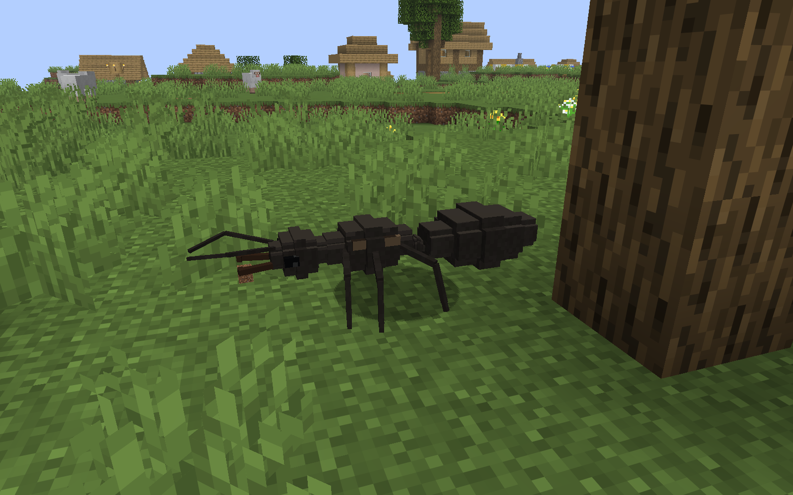
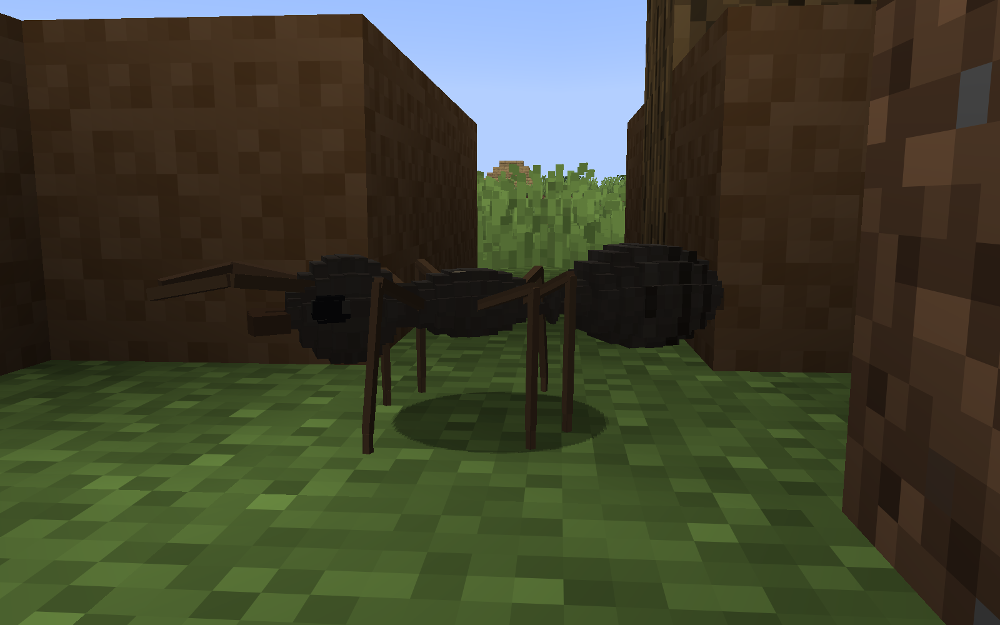
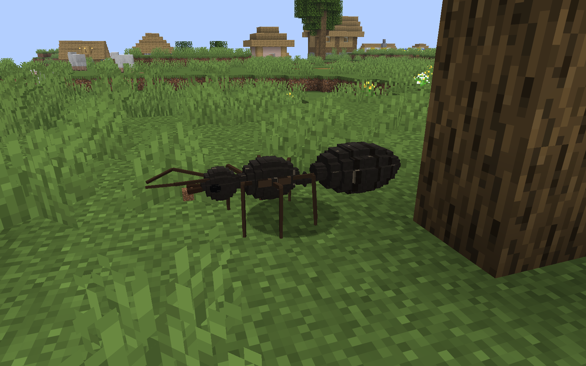
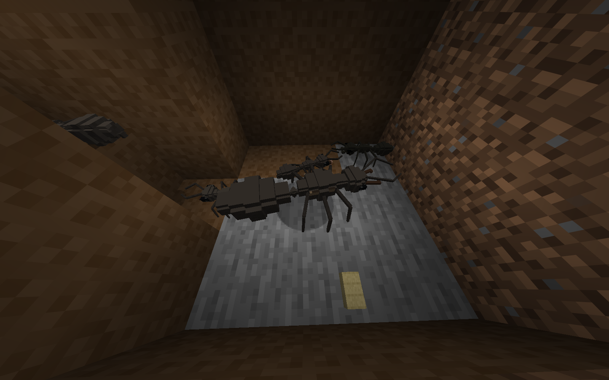
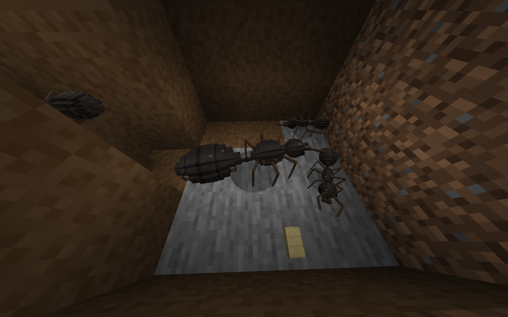
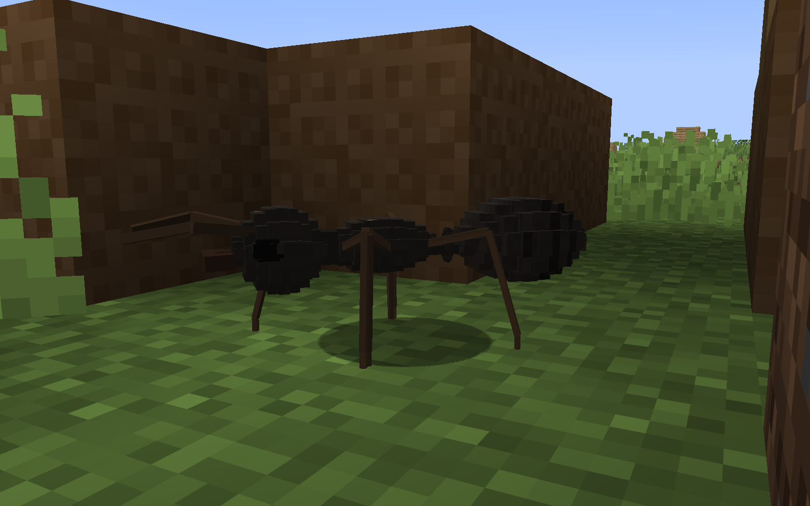
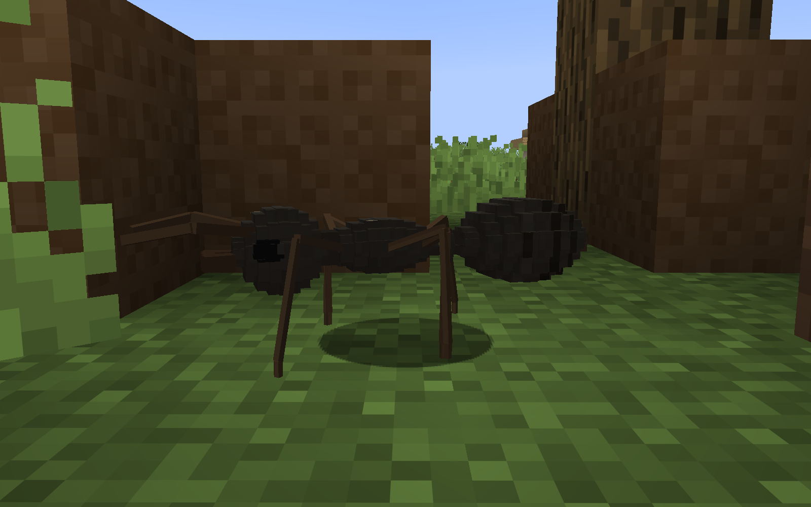

# T24 first appearance comparison

Original, unedited native1600x1000 client captures. Each pair uses a fresh copy of the same immutable checkpoint, the same body-relative lens offsets, FOV and lighting. Ants continue normal AI/animation; their positions and terrain are not edited. Separate worker/queen views have different viewing scale, disclosed below.

| Stage | Mature worker daylight | Natural queen daylight |
|---|---|---|
| Before |  |  |
| After |  |  |

Worker: forager`9a5b931b-bb9b-332d-b42a-34a6202eccca`, T23`t23-player-a5-world.zip`, root`t23-player-a5/`. FOV45?, horizontal lens distance1.645blocks, height.48, focus.24; viewing distance1.662blocks. Noon/clear, vanilla lighting, no night vision. Rendered body1.097blocks after.

Queen: naturally placed`9c71829b-25f1-3b96-acbb-96252228271d`, T22`t22-fresh-a4-world.zip`, root`New World/`. FOV55?, horizontal distance3.289blocks, height1.6, focus.35; viewing distance3.519blocks. Noon/clear, vanilla lighting, no night vision. Rendered body2.227blocks after. Dirt is actual client main-hand equipment.

| Existing nest queen before | Existing nest queen after |
|---|---|
|  |  |

Same primary queen; T23 A5 immutable source. High side lens: FOV110?, side-1.1, forward-.25, height1.9, focus.35; viewing distance1.917blocks. Same vanilla observer night vision before/after; native room/floor/workers remain. This is a silhouette comparison, with no visible-brood or cutaway claim.

Walking-frame acceptance and all rejected attempts are in the linked image reviews/index. Raw task success and manual image acceptance remain separate.

Accepted natural walking sequence, five ticks apart (no forced phase):

| After walk1 | After walk2 |
|---|---|
|  |  |

All three comparison pairs are manually accepted. The third walking frame is rejected for a thin bottom-edge discontinuity. [Final review](t24-after-comparisons-a6-image-review.json), [before worker review](t24-before-worker-a1-image-review.json), [before queen review](t24-before-queen-a5-image-review.json), [nest/rejected outdoor review](t24-before-comparisons-a4-image-review.json). Older rejected nest crops remain separately indexed.
