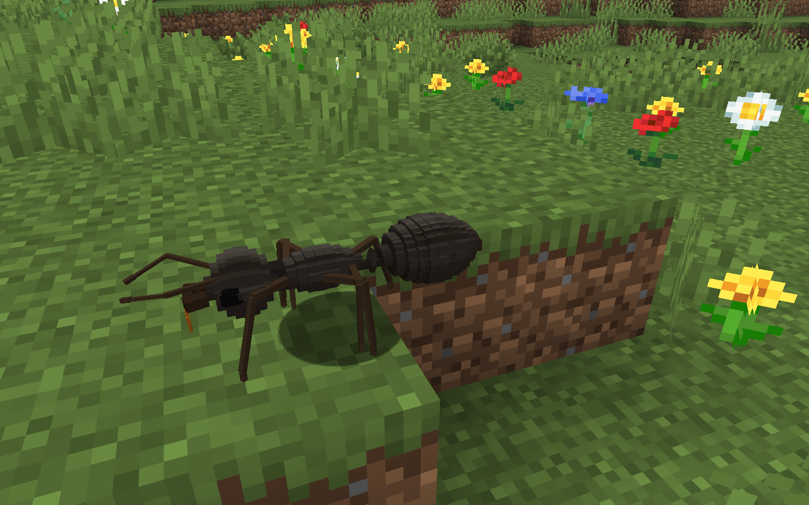
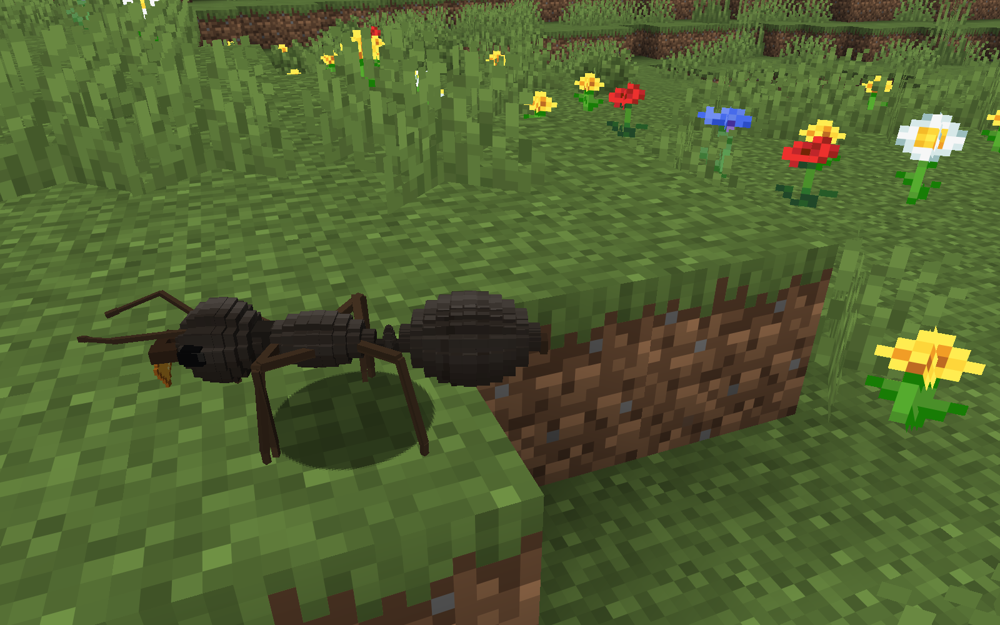
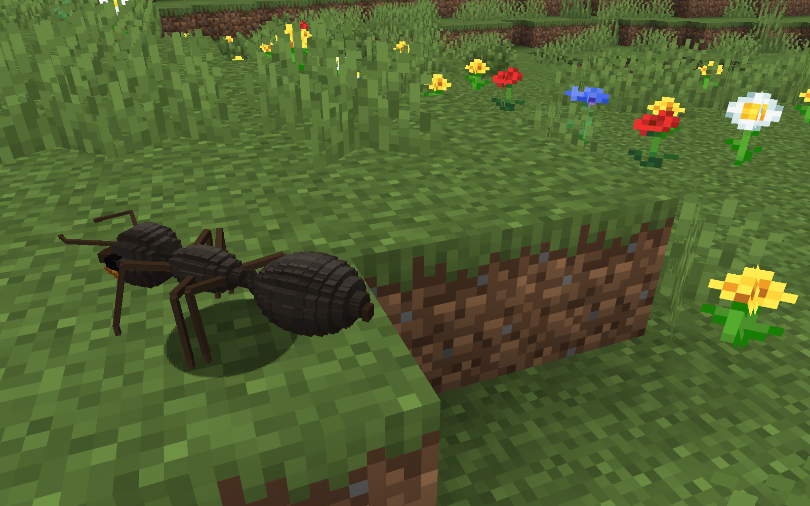
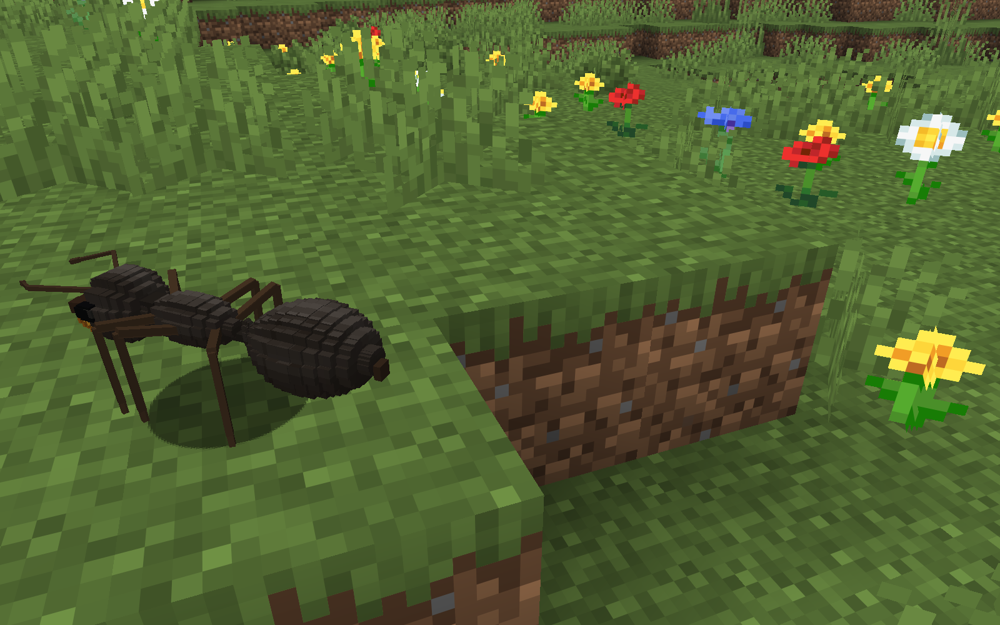
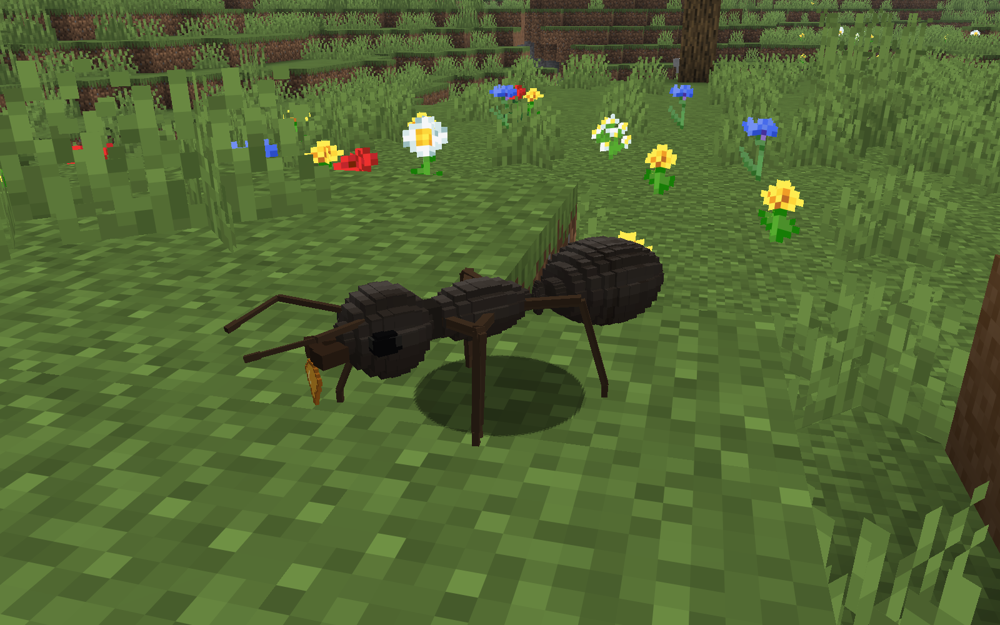
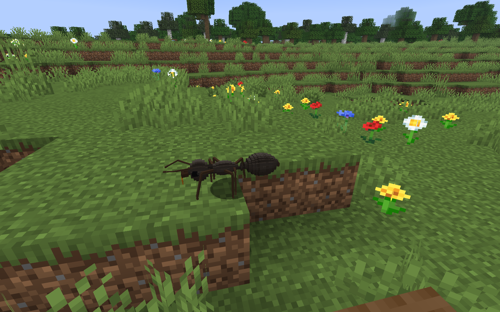
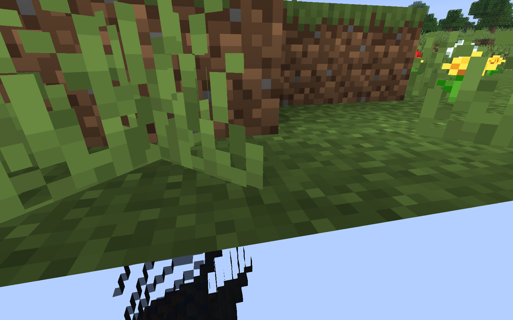

# T25 adult appearance review

**Accepted current result:** daylight worker/queen views, an ordinary-distance worker, four natural walking frames and a mature natural-colony worker carrying harvested nectar. All original PNGs below were opened at native 1600?1000. No crops, retouching, night vision, actor placement, AI freeze or forced phase.

| T24 visual reference (historical camera qualification) | T25 daylight detail |
|---|---|
|  |  |
|  |  |

Worker femur/tibia lengths 5.8/9 ? 5.3/8.2 raw units, femur width .65 ? .78; the unchanged 1.097-block body now has a shorter, raised-knee stance. Both antennae use .44-wide scapes, .34-wide funiculi and .46-wide tips; elbows remain connected and animate. Queen body remains 2.227 blocks, with massive mesosoma, four scars and one narrow petiole. Gaster alone changes from 9?5 to a fixed 11?9 mesh; entire meshes grow 219?275 worker and 223?279 queen primitives (about 25%). Smaller steps and surface-coordinate shading make the queen gaster a clearer oval, though visible facets remain for T26.

The atlas stays 512?512 with **32 texels per world block**, checked on every baked edge. Dark brown-black cuticle has broad continuous dorsal/side polish, warmer appendages and softer gaster sutures. Pale strokes and independent grain were deliberately removed because they read as flecks. Ordinary-distance polish is modest; these are texture highlights under vanilla lighting, with no new reflective shader. Callow texture/tint and maturation remain.

**Framing differs from T24:** worker reference FOV45/1.662 blocks; T25 detail FOV50/2.017 blocks. Queen retains FOV55, but lens height rises 1.6?1.8 and focus distance 3.519?3.595 blocks. Sources/subjects are the same, with natural positions and timing. T24 pixels are retained visual references; their late camera metadata does not certify capture-time clearance. No exact matched-camera claim is made.

**Ordinary viewing distance ? accepted:** FOV70, actual focus distance 2.472 blocks, noon/clear, no night vision. Worker is finishing a natural terrain step; this material frame is not an assertion that all six feet stand on one flat surface.

**Short natural walking sequence ? all four accepted:** one fixed, verified lens at FOV50. Actual client game times 11823, 11826, 11829, 11832; partial tick 1. Body Y=68 in every frame, body positions/headings continue naturally, and support tripods A/A/B/A are sampled from the rendered model. The sequence shows connected knees and changing supports, with no clipping or bottom strip. Distance-based stance remains linear with vanilla body travel; Hermite airborne return and squared-sine lift remove instantaneous reversal at exchange. Stop/reset polish remains T26.

| Walking 1 | Walking 2 |
|---|---|
|  |  |
| Walking 3 | Walking 4 |
|  |  |

**Physical food at the mandibles ? accepted:** mature worker `9a5b931b-bb9b-332d-b42a-34a6202eccca`, brood `0307320e-4be0-47f1-a5e8-c51569e5ae9b`, primary queen `9c71829b-25f1-3b96-acbb-96252228271d`. The frame records actual client main-hand **one `prime_ants:flower_nectar_v2`**, rendered item present, callow_visual=1000, entity tick=244, moving=true. The golden food fragment and gripping mandibles are readable. Production log records this worker harvesting at `(174,67,149)` at 14:58:42 before capture. No T25 player apple was used; no cargo/target assignment. This proves one genuine harvesting/carrying observation, without renewing T23 ecological claims.

**Capture-time correction ? accepted recovery, rejected solid crossing:** recorder brackets actual `GameRenderer.extract`, reads its CameraRenderState/FOV/viewport/partial tick and corresponding equipment, and freezes them at `Screenshot.takeScreenshot` before GPU readback. Callback waits cannot replace evidence with a later following lens. Clearance checks lens volume, loaded terrain/border/fluids, body probes and baked head/appendage sight rays and living subject/observer; walking uses the same path.

| Fixed clear lens recovery | Intentionally crossed solid ? REJECTED |
|---|---|
|  |  |

The small reproducer moves only the following observer lens downward into existing native solid after a clear capture, then restores the actual captured lens; ants continue normal movement. A2 and current-model A4 demonstrate clear?solid?clear acceptance/rejection/recovery. This establishes the capture timing correction, **not the old strip's exact raster cause**. A1 recovery was rejected because it used a later recomputed lens inside short grass; the corrected recovery uses stored frame coordinates.

**Complete review accounting:** 17 new PNGs opened: 10 current accepted (A4 two clear diagnostic frames, A5 eight appearance frames), 4 rejected (A1 solid/grass recovery, A2 solid, A4 solid), 3 valid diagnostic-only frames under the old T24 model (A1 clear, A2 clear/recovery). A3 produced no PNG and is incomplete due to a pre-server Java C2 native crash; source-copy archive is not normal closure. [A1 review](t25-clearance-a1-image-review.json), [A2 review](t25-clearance-a2-image-review.json), [A4 review](t25-c2-clearance-a4-image-review.json), [worker review](t25-appearance-a5-nest-image-review.json), [queen review](t25-appearance-a5-queen-image-review.json). Every accepted appearance frame is linked to its actual extraction in [worker metadata](t25-appearance-a5-nest-appearance.json) / [queen metadata](t25-appearance-a5-queen-appearance.json). Earlier rejected T23/T24 frames and their qualifications remain preserved.

The T22 source contains a dead saved observer; A5 queen segment uses the ordinary Respawn button, then verifies living dry FULL-supported observer space. There was no new observer death.

Five client starts; **992 measured additional server ticks plus an explicit 1,800-tick conservative charge for the unknown crash attempt = 2,792 charged**, within the declared six/12,000 bound. Four segments completed normal close; A1 saved/stopped on assertion failure, A3 has no normal closure; all five attempts were immediately archived. A4 proved targeted recovery with only the failing Fabric loot-hook method excluded from client JIT; no Java/dependency/RAM/timeout change.

**Current completed unfiltered acceptance: 15 unit / 195 server / 26 model, zero failures/errors/skips.** `build --console=plain --rerun-tasks` exits0 in 700.87s; all21 tasks rerun. All195 T24 server and26 model names retained, 457 current inputs accepted, production helper exclusions verified in both JARs. Final foot/profile traces match the pre-capture model preview. [Verification](../../../turnloop/directions/prime-ants-slice1/turns/T25/final-verification.json). T26 retains final surface/stop-transition polish and the survival-lit interior with visible brood.
