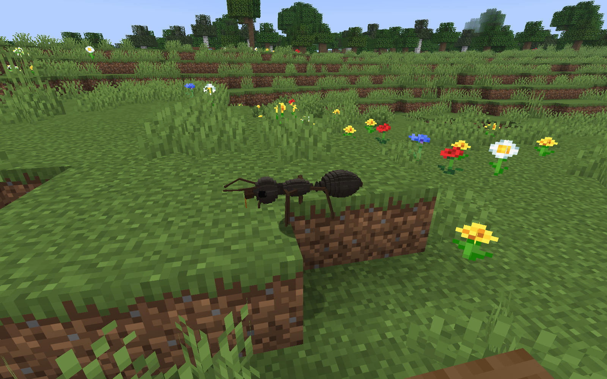
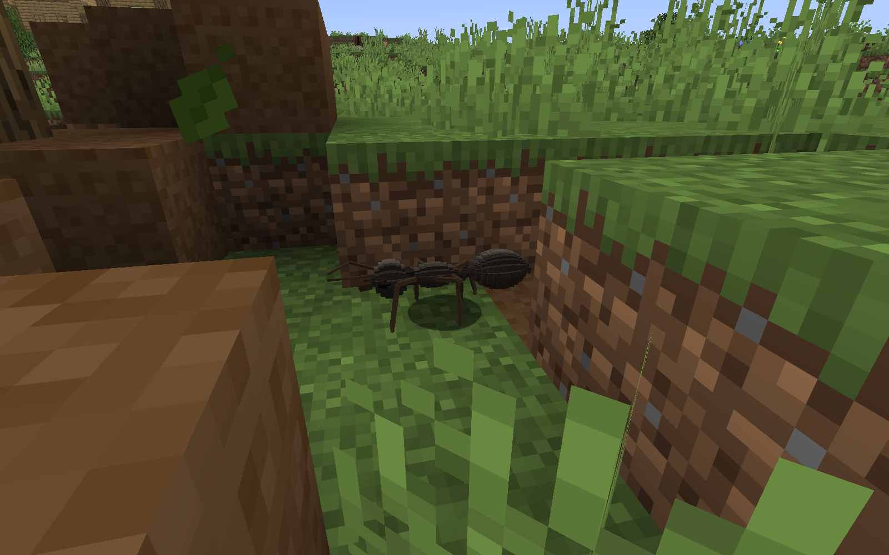
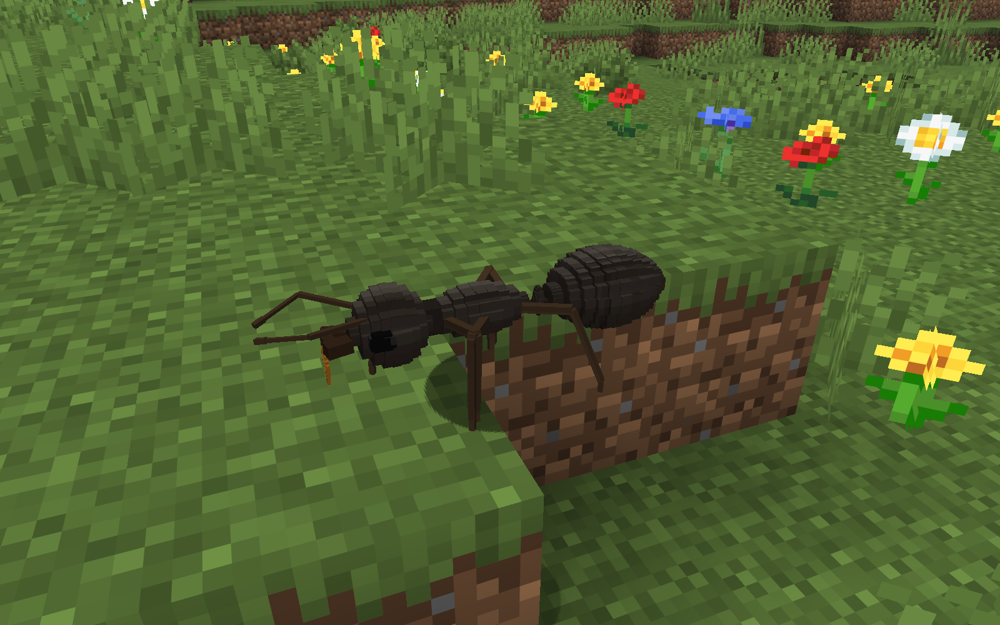
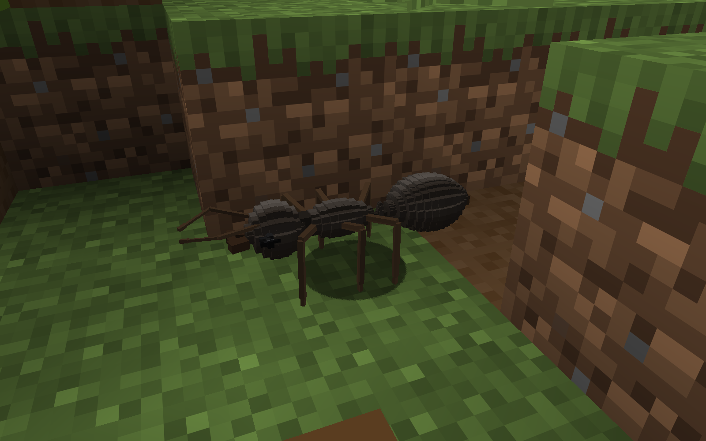
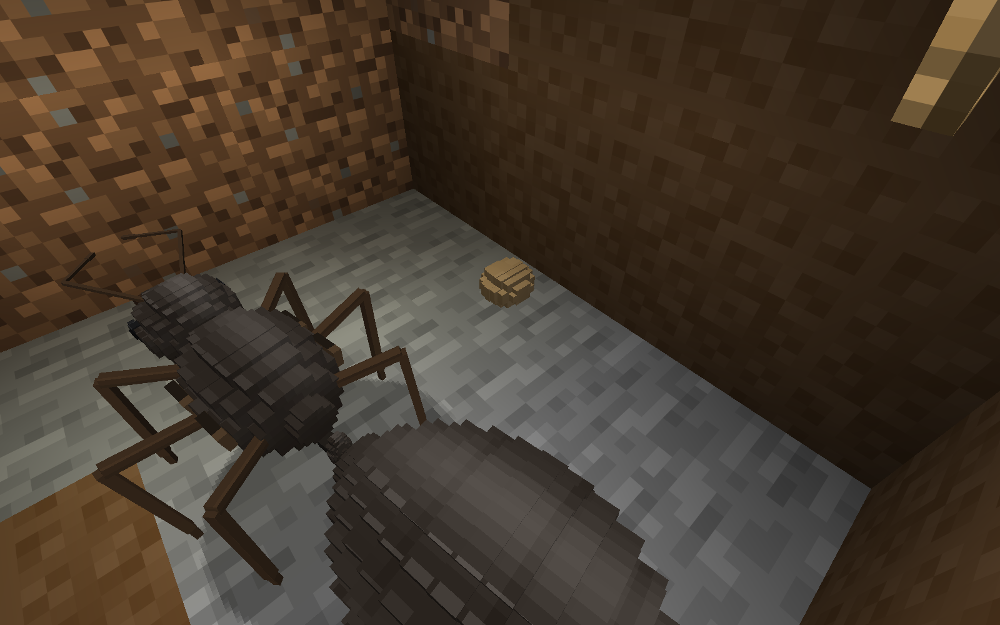
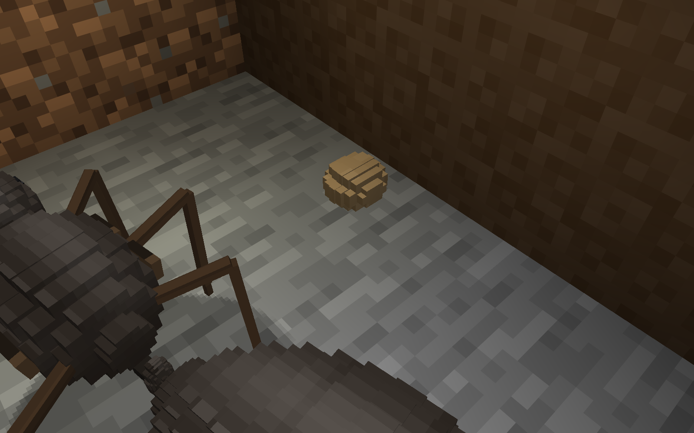
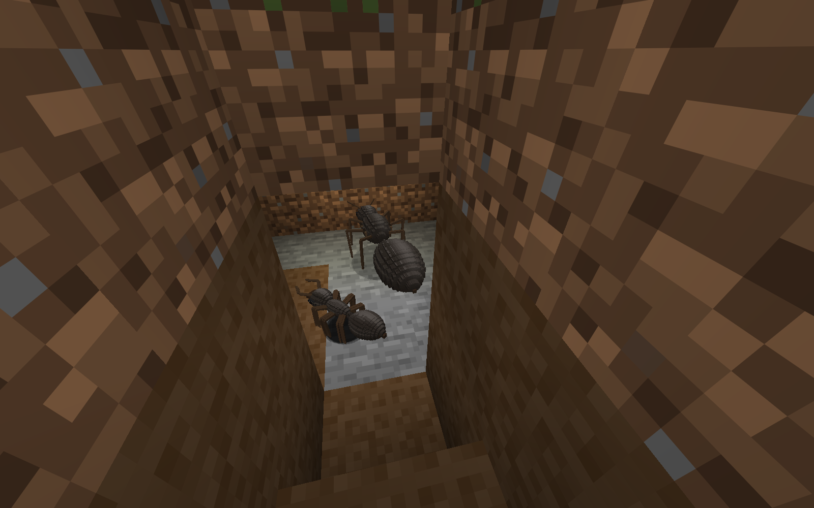
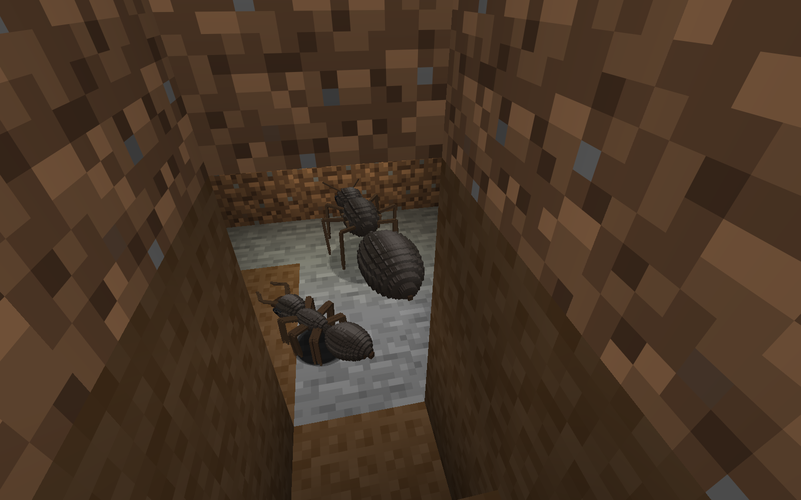

# T26 final appearance review - checkpoint closed with limitations

**Accepted: two current daylight worker views, including genuine flat-ground support at ordinary distance.** Current queen, a visually certified walking-stop-restart sequence, and the required survival-lit brood overview are **not accepted**. Six client starts are exhausted. This review records the appearance checkpoint's remaining release defects; it does not declare visual acceptance complete.

| Qualified T25 reference | Current T26 worker |
|---|---|
|  |  |
|  |  |

All original PNGs were opened at native 1600x1000. No crop, retouch, generated image, AI freeze, actor movement write or phase assignment. Same mature natural worker `9a5b931b-bb9b-332d-b42a-34a6202eccca`; callow_visual=1000. T26 ordinary FOV70 / focus distance approximately 2.472 blocks, detail FOV50 / approximately 2.017 blocks, noon/clear/no night vision, render/simulation 8/8. Actual readback-bound client game times 11669/11670, body Y=67. Six real floor probes for each frame have floor Y=67; support tripod A. Anatomy and appendages are unclipped, and capture-time clearance passes. Natural positions/framing differ from T25: there is no matched-camera claim.

Compound eyes now use nine rounded-profile cells each instead of two rectangular cells, with a small coherent dark glint; their silhouette is less square, but ordinary-distance gloss remains modest. Tibiae thicken 15% with unchanged link lengths and connected knees/body clearance. Gaster 11x9 to 13x9 reduces axial steps with 18 extra cells; complete meshes 275 to 307 worker / 279 to 311 queen (~12%). Head/gaster share one restrained mapped highlight treatment.32 texels/block, caste bounds, single petiole, elbowed antennae, scars, callow maturation and real mandible equipment attachment remain. No hair detail added. Vanilla cuticle still reads mostly matte at ordinary distance; texture marks do not prove reflective gloss.

**Queen reference only - current T26 queen capture missing:**

The final attempt failed during worker-world teardown before opening the queen reference copy. Queen geometry/UV/clearance model checks are green, but no current daylight queen visual predicate is certified. The T25 image above is historical and retains [T25's qualifications](t25-appearance-review.md).

**Natural movement-stop-restart: server observation only; visual sequence missing.** The same worker has 1,500 consecutive FULL-loaded, living server samples at ticks 86-1585, one position/task/on-ground record per tick, no gaps. One representative exterior harvest stop is ticks 186-200 inclusive (15 unchanged-position ticks), at `(173.408655,67,149.947787)`, followed by movement at 201. Other real stationary intervals are preserved. These establish a genuine natural stationary interval, without a forced task or velocity/phase write. However, the continuous recorder retained **zero actual render samples**, and no 8-12 keyframe sequence was produced. Snapping, sliding, floating feet and stale moving poses remain **unknown**, not passed. The two daylight worker photos are walking/material views, not transition evidence. [Trace analysis](../../../turnloop/directions/prime-ants-slice1/turns/T26/transition-analysis.json), [raw server trace](t26-final-review-a6-worker-appearance.json). Existing planted-foot, joint connectivity, floor and C1 endpoint model checks remain substantive in all 26 named cases.

**Survival-lit nursery - four rejected original frames, no accepted overview or stage set.**

| Rejected A5 overview: queen clipped | Rejected A5 cocoon detail: queen clipped |
|---|---|
|  |  |
| Rejected A6 overview: brood behind wall | Rejected A6 detail: failed brood sight ray |
|  |  |

The actual active record `1a81b11b-8275-418f-90db-5f6aaed81ce6`, slot b, was a non-founding larva in the immutable T23 source. T23 production logs show its laying at pile tick 2748 and larval stage 2868. A carried chicken already retained in the checkpoint was physically fed by nurse `c6aabfad-4c5c-39e7-bb2d-96f01f1fa75d` in T26 A4; production advances it to cocoon at 3276 with nourishment 12000. A5/A6 display state is `a=empty,b=cocoon,c=empty`, matching that living, unexpired record; cocoon progress 86 then waits because room torches make production report `enclosure_chamber_obstructed`. No supplied/decorative brood or expired history is credited. Egg and larva models are asset-checked but lack accepted game-stage images. [Production excerpt](../../../turnloop/directions/prime-ants-slice1/turns/T26/brood-production-log-excerpt.txt).

T26 ordinary inventory drops total **four apples and two raw chicken**, in two declared 2+1 batches, with living survival drop/retreat; actual collection/intake of those new T26 drops is not certified. The cocoon's feeding cargo was already in the T23 checkpoint, so its maturation is not attributed to the new drops. Caption: **player-fed natural colony**, including T23 feeding history, rather than autonomous growth. All continuations use their actual closed state; no reserves, durations, stages or clocks were edited. Work 20/brood 100 and persisted stage duration 120 disclosed.

Exactly the two previously supplied inventory torches are consumed through normal survival `useItemOn` at `(167,66,146)` / `(169,66,146)`, existing supports `(167,66,147)` / `(170,66,146)`, measured reaches 1.043/1.519 blocks. A3 had demonstrated normal entry; later pre-measurement spectator setup uses checked existing supported stands. Placement/view is living survival, actual player eye, no virtual lens or measured teleport; the spectator callback is disabled. Brightness0.5/no night vision, block light 13 / sky light 12 at the recorder sampling position above the pile (T27 correction; no separate sky-zero measurement). No artificial light writes, block-setting commands, walls/brood breaking, enlargement or terrain clearing. Projection/lighting records support provenance, **not acceptance of the rejected images**.

**Remaining defects:** modest ordinary gloss and visible adult terraces; current queen view missing; zero rendered stop/restart coverage and no keyframe set; all nursery views rejected and egg/larva stage images missing; vanilla room torches obstruct the current nursery habitat. Brood capsules remain faceted. The development continuous recorder was corrected after A6 for partial-tick sampling and teardown; only compile/model validation was possible at the launch cap. Ordinary accepted image rendering/assets/camera/readback logic is unchanged; no runtime recovery or transition-quality claim is made.

First unfiltered build failed one of 195 cases; a defense fixture retreat was outside the supported platform (barrier floor below, original terminal player state unknown); saved-world diagnosis and one test-only supported-retreat correction precede a passing isolated recovery. Production defense and original assertions unchanged. Current completed unfiltered acceptance: **15 unit / 195 server / 26 model**, no failure/error/skip; all 195 and 26 baseline names retained, both production JARs exclude dev helpers. Recovery build exits0 in 678.36s, all 21 tasks rerun. Final unfiltered acceptance and scoped commit: see [T26 report](../../../turnloop/directions/prime-ants-slice1/turns/T26/report.md). All 6 exited clients immediately archived. Ledger:5437 measured A1-A5 ticks plus 6000 conservative interrupted-A6 debit = 11437 charged of 24000; A6's 1624 known partial segment ticks are included in, not added to, that debit. T25's historical1800 crash debit remains historical. No T26 C2 recurrence under the optional exact-method client JIT exclusion.

**T27 release item:** test the production jar in a clean 26.3 Fabric client **without the dev JIT exclusion**. If the C2 crash recurs, diagnose/change the triggering path or document the issue and workaround in EN/RU. The dev workaround is not clean-client acceptance. Carry the torch habitat incompatibility and unverified recorder recovery into release triage; no additional appearance turn is assigned.

T27 lighting correction: all four preserved T26 capture records report block_light=13 and sky_light=12. The original T26 turn report said sky zero incorrectly; original JSON/failed images remain preserved. Torch compatibility is handled separately by the T27 release check.
